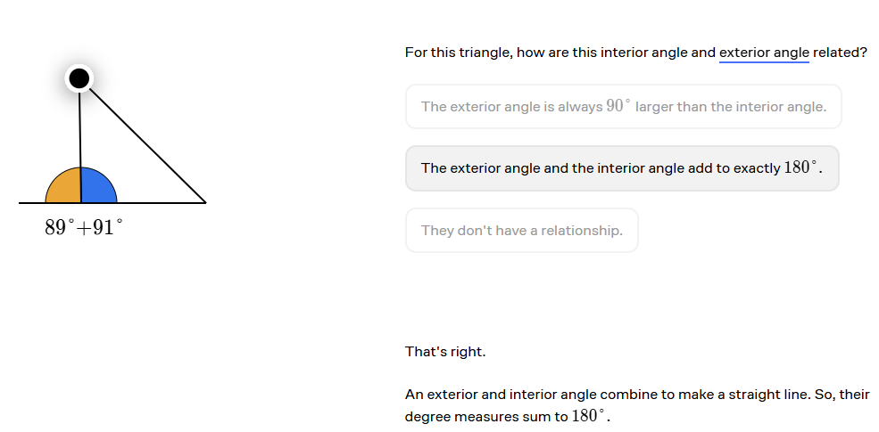
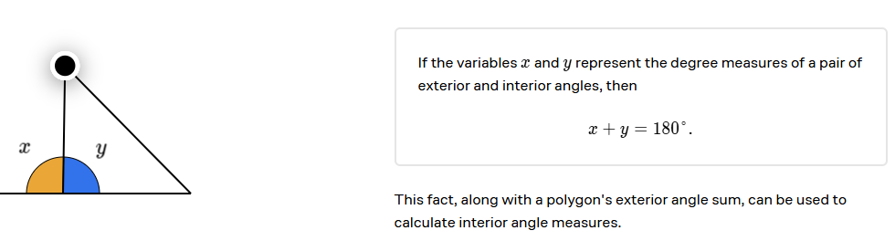
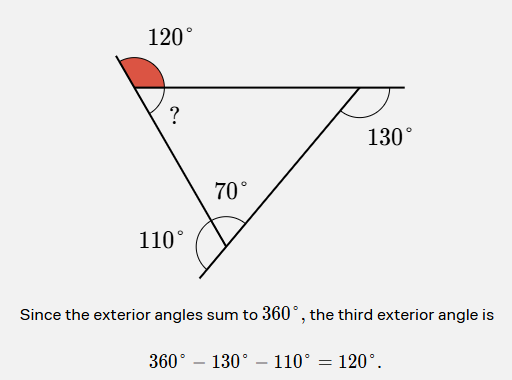
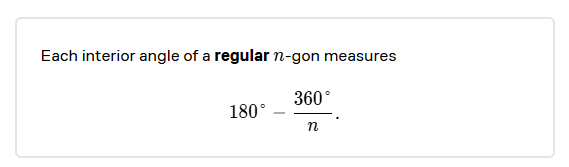
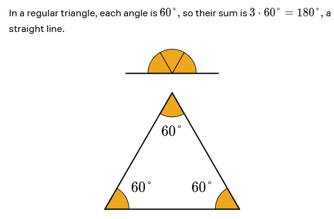
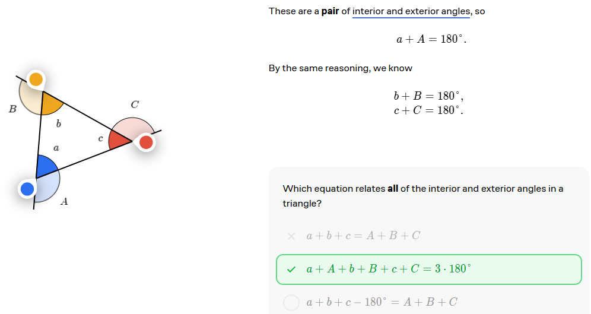
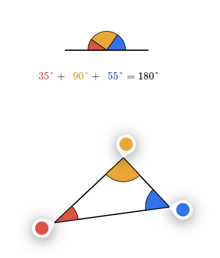
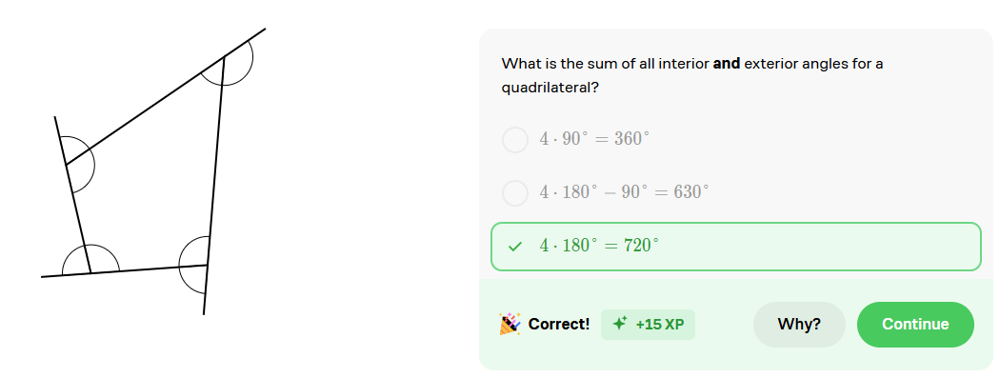
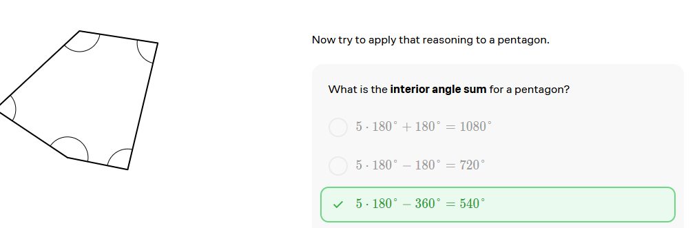

# Geometry

## Angles in Polygons

1. an angle is formed when two lines meet.
2. Between 0 and 180 degrees.

### Hexagon

1. 6 sides
2. 6 angles
3. 720 degrees
4. Each angle is 120 degrees

### Quadrilateral

1. 4 sides
2. 4 angles
3. 360 degrees
4. Each angle is 90 degrees

## Exterior and Interior Angles

### Exterior Polygons Angles

Which of these regular polygons has the greatest exterior angle sum?

1. Triangle (3 sides) = 360 degrees
2. Square (4 sides) = 360 degrees
3. Pentagon (5 sides) = 540 degrees
4. Hexagon (6 sides) = 720 degrees

### Interior Polygons Angles

Two adjacent angles in a polygon that share a side are called **adjacent angles**.

Interior angle and exterior angle related

Represent the degree measures of a pair of exterior and interior angles

What is the measure of the unknown angle?

Determine the interior angle measure for any regular n-gon

### Polygon Angle Relationships

The equation that relates all the interior and exterior angles in a triangle is fundamental in understanding polygon geometry.

$$
\text{Interior Angle Sum} + \text{Exterior Angle Sum} = 540 \text{degrees}
$$

**The interior angle sum for any triangle is 180°.**
$$
a + b + c = 180
$$

### Angle Sums for All Polygons

What is the sum of all interior and exterior angles for a quadrilateral?

$$
4 *180° = 720°
$$ 

What is the interior angle sum for a quadrilateral?

$$
720° - 360° = 360°
$$

**The interior angle sum for any quadrilateral is 360°**
 

 

### Polygon Angle Sum Formula

The sum of the interior angles of a polygon is given by the formula:

$$
n * 180° - 360°
$$

Where n is the number of sides in the polygon.

$$
Since 360° = 2 * 180° 
$$

$$ 
n * 180° - 2 * 180° = (n - 2) * 180°
$$

The interior angle sum of any n-gon is:

$$
(n - 2) * 180°
$$

**What is the sum of the interior angles of a  12-gon?**

$$
(12 - 2) * 180° = 10 * 180° = 1800°
$$
