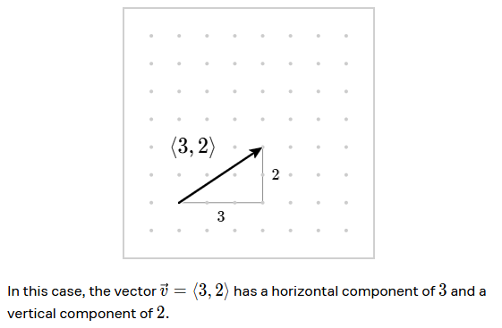
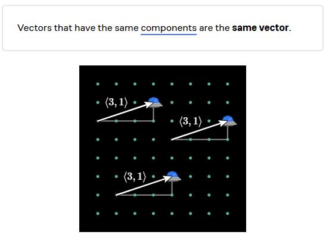
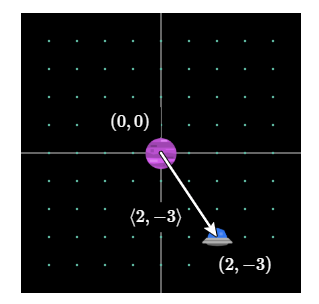

# Linear Algebra

## Introduction

We use arrow in the symbol of vector. For example, $\vec{v}$ is a vector.
That's pronounced as "vector v".

## Components of a vector

A vector has a horizontal component and a vertical component. The horizontal component is called the x-component and the vertical component is called the y-component.

## Vectors and Points

Points and vectors are different. Points are locations in space, while vectors are directions and magnitudes.

