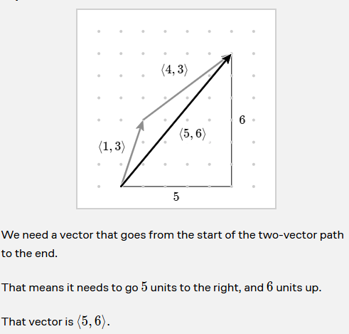
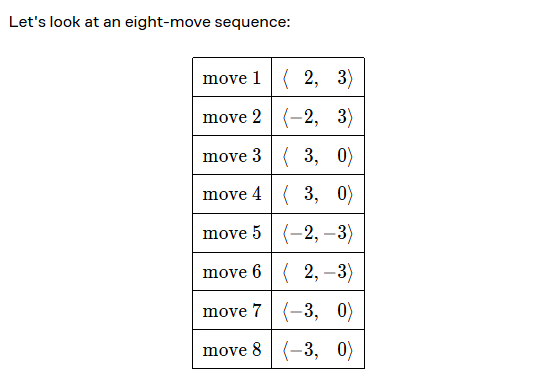
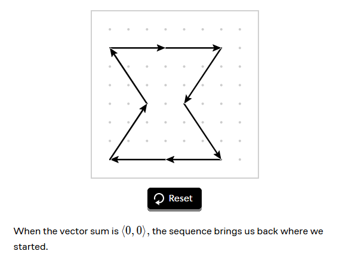
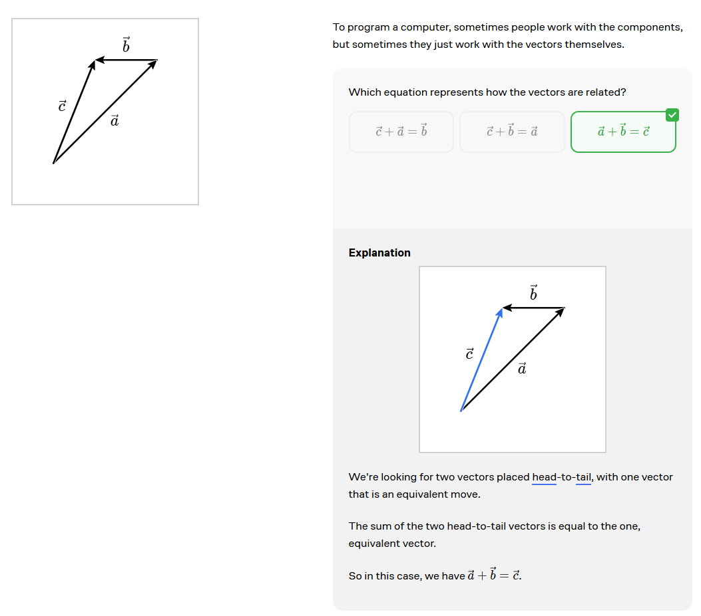
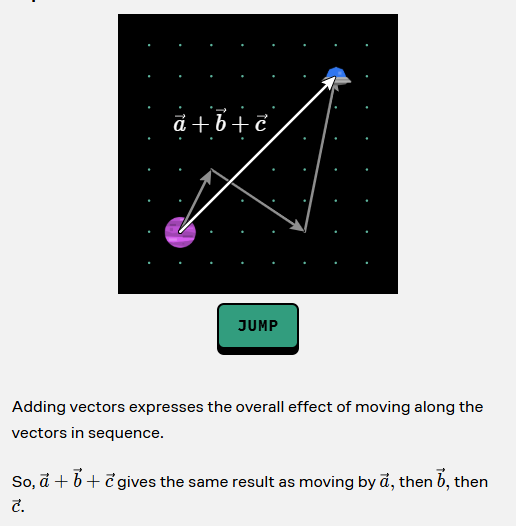

# Linear Algebra

## Introduction

We use arrow in the symbol of vector. For example, $\vec{v}$ is a vector.
That's pronounced as "vector v".

## Components of a vector

A vector has a horizontal component and a vertical component. The horizontal component is called the x-component and the vertical component is called the y-component.

## Vectors and Points

Points and vectors are different. Points are locations in space, while vectors are directions and magnitudes.

## Adding Vectors

To find the effect of shifting by multiple vectors in order, we can add the vectors.

$$
(a, b) + (c, d) = (a + c, b + d)
$$

$$
x= 2 + -2 + 3 + -3 + 4 + -4 + 5 + -5 = 0
y= 3 + -3 + 4 + -4 + 5 + -5 + 6 + -6 = 0
$$

