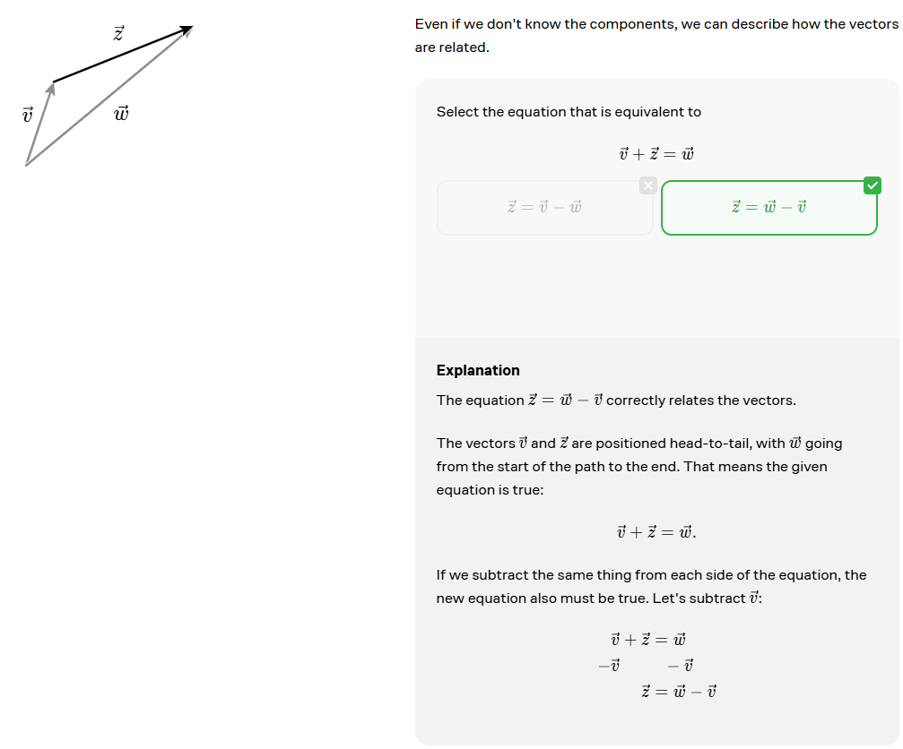

# Linear Algebra

## Introduction

We use an arrow in the symbol of a vector. For example, $\vec{v}$ is a vector.
That's pronounced as "vector v".

## Components of a Vector

A vector has a horizontal component and a vertical component. The horizontal component is called the x-component, and the vertical component is called the y-component.

## Vectors and Points

Points and vectors are different. Points are locations in space, while vectors represent directions and magnitudes.

## Adding Vectors

To find the effect of shifting by multiple vectors in order, we can add the vectors.

$$
(a, b) + (c, d) = (a + c, b + d)
$$

For example, consider the following sequence of moves:

$$
x= 2 + (-2) + 3 + (-3) + 4 + (-4) + 5 + (-5) = 0
$$
$$
y= 3 + (-3) + 4 + (-4) + 5 + (-5) + 6 + (-6) = 0
$$

The sum of these vectors is (0,0).

We can also visualize the vectors themselves:

And see how they add up in sequence:

## Bringing a Vector Back to the Origin

To bring a vector back to the origin, we can add the negative of the vector.

$$
(a, b) + (-a, -b) = (0, 0)
$$

### Example

$$
(2, 3) + (-2, -3) = (0, 0)
$$

Taking the negative of a vector is the same as flipping it across the origin.

$$
(2, 3) + (4, 2) + (1, -5) = (7, 0)
$$
$$
(2, 3) + (4, 2) + (1, -5) = (2+4+1, 3+2-5) = (7, 0)
$$

If we add the negative of a vector to itself, we get the zero vector.

$$
-(\vec{a} + \vec{b} + \vec{c}) = -\vec{a} - \vec{b} - \vec{c}
$$

## Head to Head

To add vectors head to head, we place the tail of the second vector at the head of the first vector.

### Example 1

### Example 2

## Length of a Vector

The length of that vector is also the distance from one location to the other. For a vector $\vec{v}, we'll denote the length as $$|\vec{v}|$$

## Length of Components

We can find the length of the components of a vector using the Pythagorean theorem.
The length of a vector $\vec{v}$ = (a, b) is:
$$
|\vec{v}| = \sqrt{a^2 + b^2}
$$

### Example 1:

What is the length of  $\vec{v}$ = (2, -6)?

