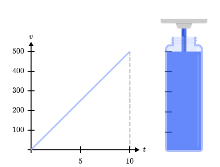

# Calculus

## Introduction

Calculus is the mathematical study of change. It has two main branches: differential calculus and integral calculus. Differential calculus is concerned with the study of the rates at which quantities change. Integral calculus is concerned with the accumulation of quantities and the areas under curves.

$$ v(t) = 50t $$