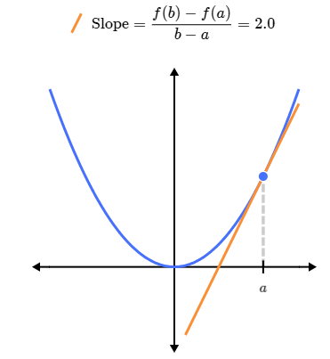

# Calculus

## Introduction

Calculus is the mathematical study of change. It has two main branches: differential calculus and integral calculus. Differential calculus is concerned with the study of the rates at which quantities change. Integral calculus is concerned with the accumulation of quantities and the areas under curves.

$$ v(t) = 50t $$

## Tangents

The tangent line to a curve at a point is the line that best approximates the curve at that point. The slope of the tangent line is equal to the derivative of the function at that point.

The derivative of a x = a is the slope of the tangent formed as the value of b approaches a.

$$  f'(a) = \lim_{b \to a} \frac{f(b) - f(a)}{b - a} $$

we are using the limit notation to define the derivative of the function f'(a) at the point a.

In this expression:

- f'(a) is the derivative of the function f at the point a.
- lim is the limit operator.
- b is a variable that approaches the point a.
- $$ \frac{f(b) - f(a)}{b - a} $$
    represents the average rate of change of the function between b and a.
