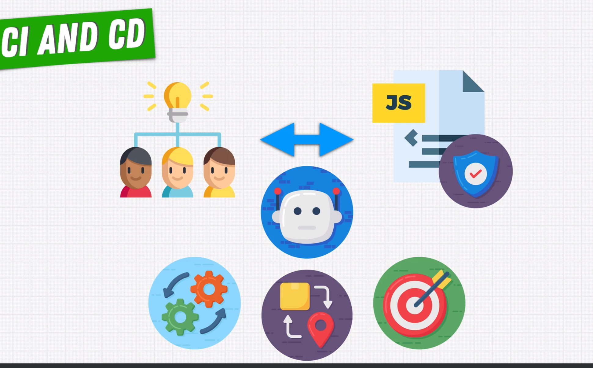
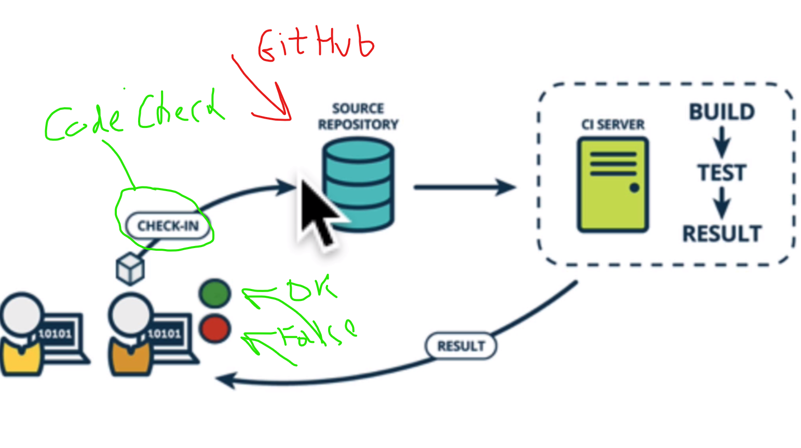

# Work process

## Main information

1. **CI** - Continuous Integration
2. **CD** - Continuous Delivery
3. **CD** - Continuous Deployment

## Continuous integration (CI)

- Main idea: is frequently committing code to a shared repository
- Agile development (extreme programming) - release small changes frequently (every day)
- Added some linters and test not a local machine but a CI Server

### Tools and services

<https://circleci.com/>
<https://www.travis-ci.com/>
<https://www.jenkins.io/>

## Continuous delivery (CD)

- is a process that builds on Continuous Integration
- gives you confidence that your code will work in production

1. testing our code and running our linters
2. your code it's ready to be delivered to the production environment (staging environment)

## Continuous deployment (CD)

- it takes Continuous delivery and automates it
- is't for each product.
- we use to release our code to production
