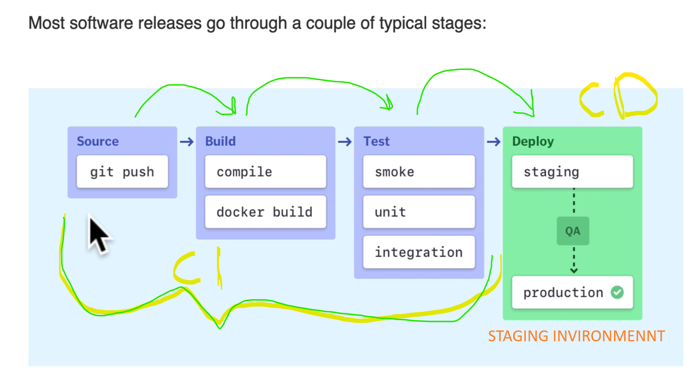

# Work process

## Continuous integration (CI)

1. Authorization work process
2. Added some linters and test not a local machine but a CI Server
3. It's called agile development (extreme programming)

## Continuous delivery (CD)

1. testing
