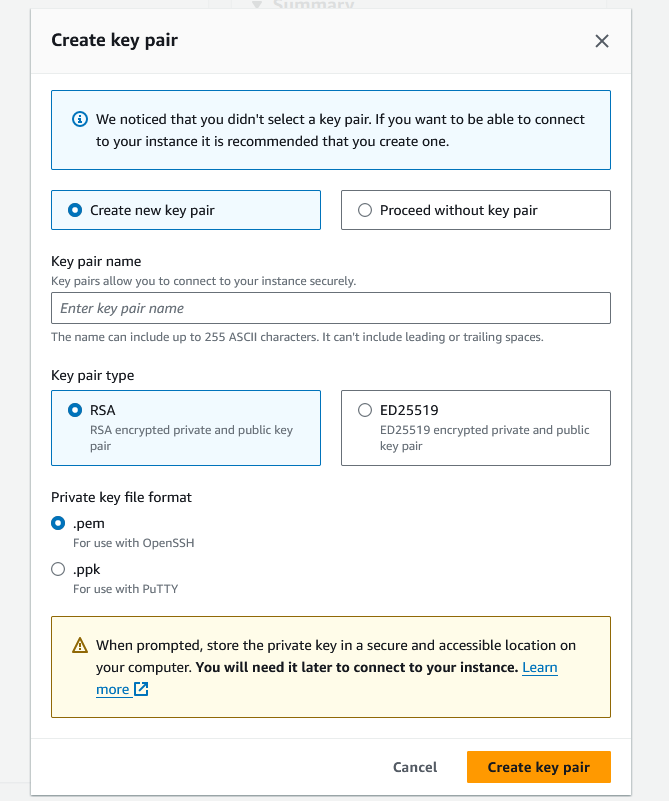

# Min info to get started with AWS

## AWS Free Tier

[Lint to the registration free account](https://aws.amazon.com/free/?all-free-tier.sort-by=item.additionalFields.SortRank&all-free-tier.sort-order=asc&awsf.Free%20Tier%20Types=*all&awsf.Free%20Tier%20Categories=*all)

## AWS Management Console

[Link to the AWS Management Console](https://aws.amazon.com/console/)

## EC2

EC2 is a service that allows to create virtual machines in the cloud.



```bash
react-portfolio
```

<https://eu-north-1.console.aws.amazon.com/ec2/home?region=eu-north-1#Instances>:


## Putty

[Putty AWS authorisation]<https://www.youtube.com/watch?v=jv-dgOfFN4o>

- allows to control a remote machine, all using the command line
-

### commands

```bash
exit
```

### yum

- is a package manager for Linux (npm for node)

- `sudo yum update -y`  update all the packages on the system (update the system without asking for confirmation) run the command as root

- `sudo yum install docker`  install the docker package

- `sudo service docker start`  start the docker service

- `sudo docker info`  check the docker service

- `sudo usermod -a -G docker ec2-user`  add the ec2-user to the docker group (to avoid using sudo when running docker commands)

```bash
sudo yum update -y

sudo yum install docker

sudo service docker start

sudo docker info

sudo usermod -a -G docker ec2-user
```

### Docker deploying a container to AWS

#### Amazon elastic container service (ECS)

- is the Amazon special build service for deploying Docker containers

- ESC is cost money (mor complicated)

#### Docker Compose

- is a tool for defining and running multi-container Docker applications

- `--restart=always`  restart the container automatically if it stops

``` bash
docker run --restart=always -p 8000:8000 -p 3000:3000 maksymposkannyi/portfolio-react
```

### Node app crashes on AWS

- use `pm2` to run the node app
