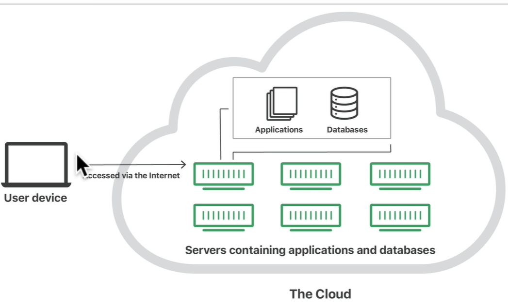
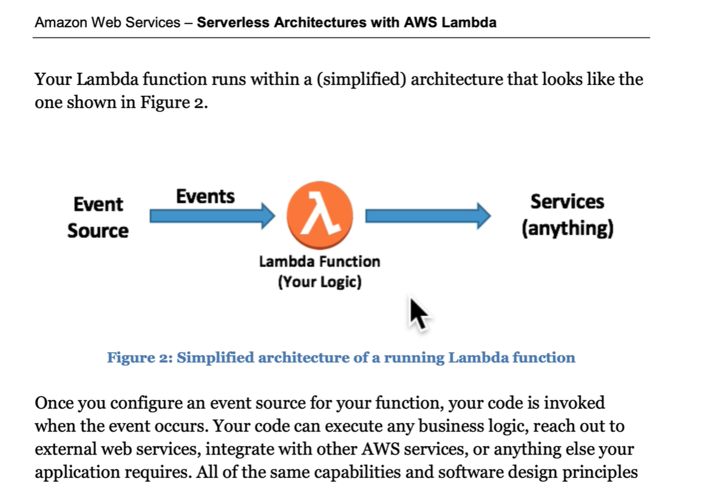
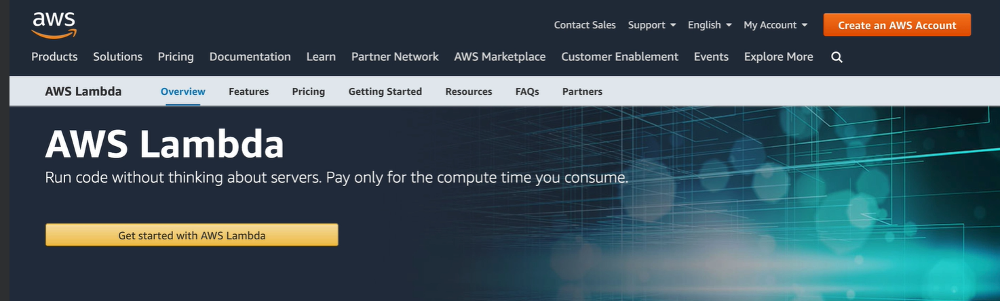
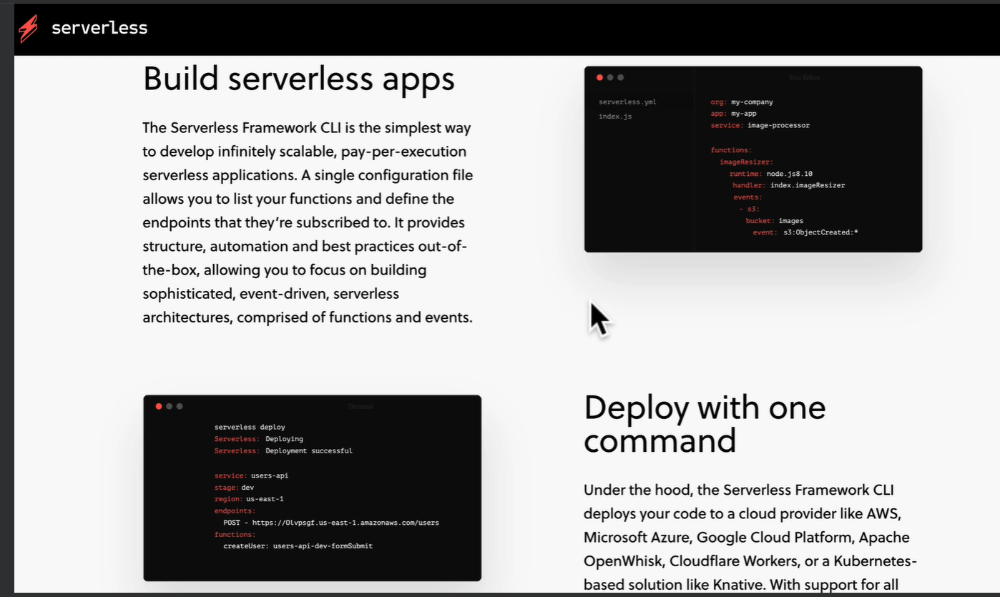
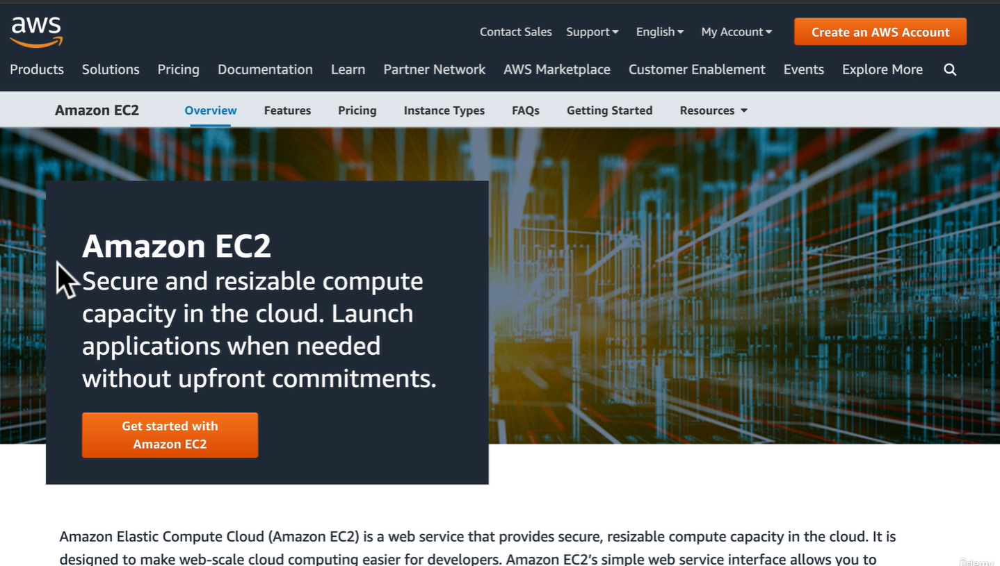
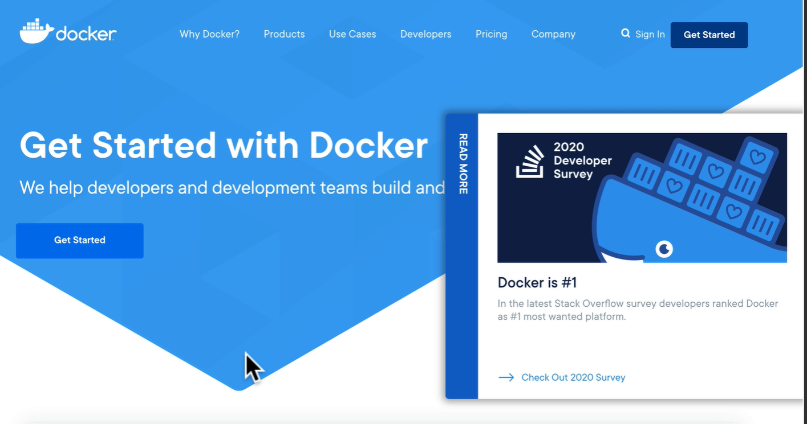
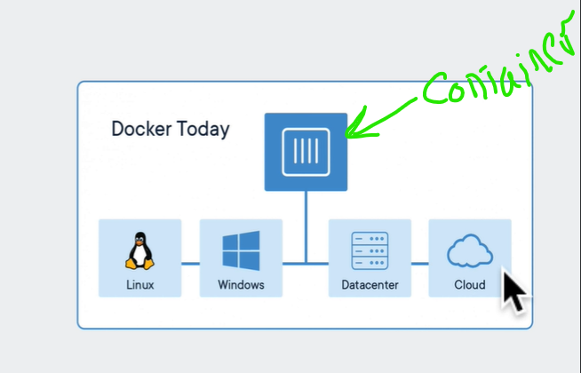
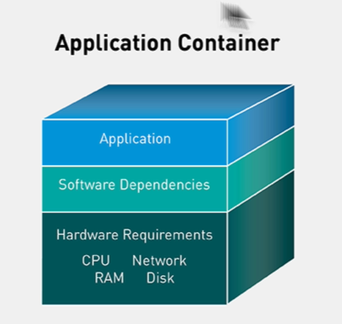
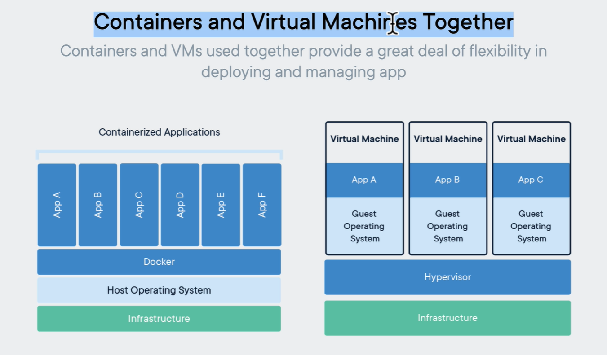
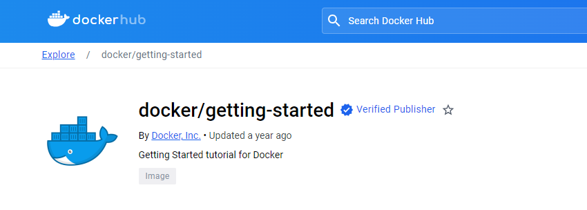

# main information

## Services providers

- AWS (Amazon Web Services)
- Azure (Microsoft)
- Google Cloud Platform (Google)

## Main approaches to deploy

### Serverless Architecture with AWS Lambda

- use Serverless Framework to deploy

### Virtual Machine

- AWS use EC2 (Elastic Compute Cloud) to deploy

- EC2 is a virtual machine allowing to run an application on the cloud (AWS)

### Docker container

<https://www.docker.com/get-started/>

- build a Docker container
Docker container is a small boxes run anywhere on our desktop.

    **containers still completely isolated from each other and the host system**

Virtual Machine vs Docker container:

- Docker container is more lightweight than Virtual Machine
- Docker container is more portable than Virtual Machine
- Docker container is more efficient than Virtual Machine

- Virtual Machine is more secure than Docker container
- Virtual Machine is more stable than Docker container

Containers and Virtual Machines Using together in EC2 Container Service

#### Container VS Images

- container contain your running application
- images collection all the files and dependencies needed to run a container

#### Docker hub <https://www.docker.com/products/docker-hub/>

- docker hub is a repository of docker images

