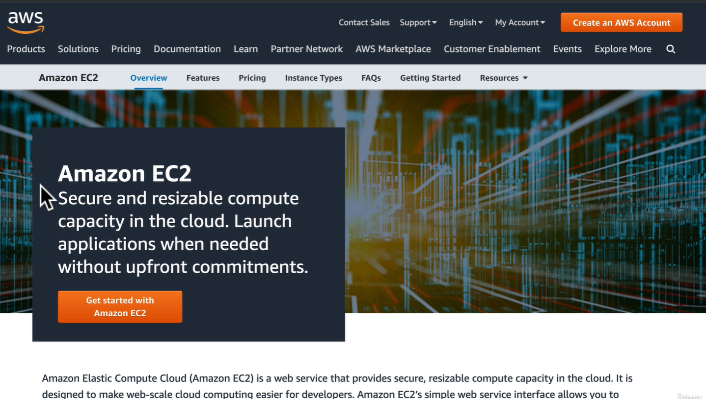

# Fundamentals

- [Fundamentals](#fundamentals)
  - [Cloud Serverless](#cloud-serverless)
    - [Serverless Architecture with AWS Lambda](#serverless-architecture-with-aws-lambda)
      - [AWS Virtual Machine](#aws-virtual-machine)
  - [AWS Certificates](#aws-certificates)

## Cloud Serverless

### Serverless Architecture with AWS Lambda

- use Serverless Framework to deploy

#### AWS Virtual Machine

- AWS use EC2 (Elastic Compute Cloud) to deploy

- EC2 is a virtual machine allowing to run an application on the cloud (AWS)

## AWS Certificates

1. short information about services
<https://www.youtube.com/watch?v=eel_YiYhxr8&ab_channel=ADV-IT>

2. chanel <https://www.youtube.com/@ADV-IT>
