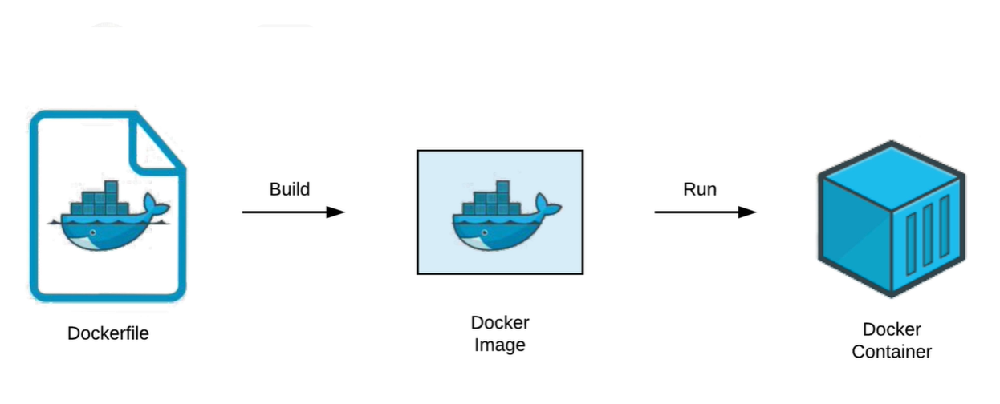

# Instruction to run a docker container

## Run docker container

- `-p` flag is used to publish a container's port to the host
- `80:80` port 80 on the container maps to port 80 on my machine
- `docker/getting-started` is the name of the image

```bash
docker run -p 80:80 docker/getting-started
docker login
```

```browser
http://localhost:80
```

## Creating a Docker image from a Dockerfile

- allows to take a base image like our getting-started image
<!-- node<version>-alpine -->

- `FROM` is used to specify the base image
- `node` is the name of the base image
- `lts` is the version of the base image
- `-alpine` is the tag of the base image (alpine is a lightweight version of the node image for Linux operating systems)

- `WORKDIR` is used to specify the working directory inside the container
- `/app` is the working directory inside the container where the application will be stored

- `COPY` is used to copy files from the host to the container
- `.` is the source directory
- `.` is the destination directory

- `RUN` is used to run commands inside the container
- `npm install` is the command to install the dependencies
- `--only=production` is a flag to install only the production dependencies (not the development dependencies)

- `npm run build` is the command to build the application
- `--prefix client` is a flag to specify the directory where the command will be run

- `USER` is access to the container (run our application as a non-root user for security reasons)
- `node` is the user to run the application

- `CMD` is used to specify the command to run when the container starts
- `["npm", "start", "--prefix", "server"]` is the command to start the application inside the container

```Dockerfile
FROM node:lts-alpine

WORKDIR /app

COPY . .

RUN npm install --only=production

RUN npm run build --prefix client

USER node

CMD ["npm", "start", "--prefix", "server"]

EXPOSE 8000
```

### Docker feature called layers

Basically, we're going to break our commands down into smaller components so that they can be cached and reused in the future.

- docker Creating a new layer each time we run a copy or run command
- we might be making new images hundred of times per day. It's important to make this steps as efficient as possible.

```Dockerfile
FROM node:lts-alpine

WORKDIR /app

COPY package*.json ./

COPY client/package*.json client/
RUN npm run install-client --omit=dev

RUN npm run install-server --omit=dev
COPY server/package*.json server/

COPY client/ client/
RUN npm run build --prefix client

COPY server/ server/

USER node

CMD ["npm", "start", "--prefix", "server"]

EXPOSE 8000
```

### Exclude node_modules folder from the container

*First issue the operating systems. We youse alpine for Linux and this problem for node modules folder.*
*Need to install the node modules in the container, and then build the application.*

- Creating a `.dockerignore` file to ignore the node_modules folder (to avoid copying it to the container)

``` .dockerignore
.git
*/node_modules
```

## Building a Docker image from a Dockerfile


Two steps to build a Docker image from a Dockerfile:

1. build a docker image
2. run the image to create a container

Usage:`docker image build [OPTIONS] PATH | URL | -`

- `.` is the path to the Dockerfile
- `-t` is used to tag the image (allows us to give the image a name)
- `maksymposkannyi/portfolio-react`  userId from Docker Hub and the name of the image

```bash
docker build . -t maksymposkannyi/portfolio-react

```

- `it` is used to run the container in interactive mode
- `-p` is used to publish a container's port to the host
- `8000:8000` port 8000 on the container maps to port 8000 on my machine
- `maksymposkannyi/portfolio-react` is the name of the image

```bash
docker run -it -p 8000:8000 maksymposkannyi/portfolio-react
```

### How we run our applications as Docker containers?

- execute the `docker run` command to run the container with the image
- is a completely isolated environment from our computer and our host

### Publish the image to Docker Hub

```bash
docker login
docker push maksymposkannyi/portfolio-react
```

Then we can be downloaded from Docker Hub and run on any computer

```Dockerfile
FROM maksymposkannyi/portfolio-react:latest
```
