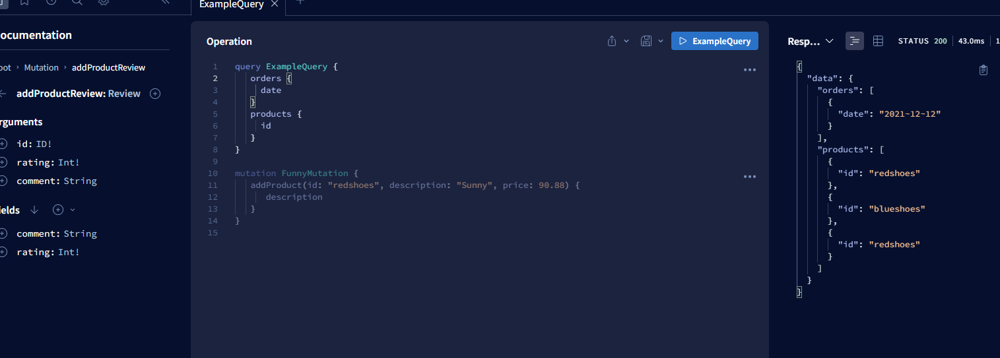

# Implementation Apollo

[Documentation](https://www.apollographql.com/)

- is another implementation of GraphQL
- match larger then more features

## Apollo Client

- halp make qraphql queries and save graphical data in your application
-

## Apollo Server

- allows to create qraphql server in node
- can work with express, koa, hapi, etc.
- helps you run and deploy your qraphql server to serverless environments (like AWS Lambda)
- included functionality to help subscription in your sever (real-time data updates to your client like chat application)

## Apollo Server Express

- is a library that helps you integrate Apollo Server with Express
