# Work process

## Main information

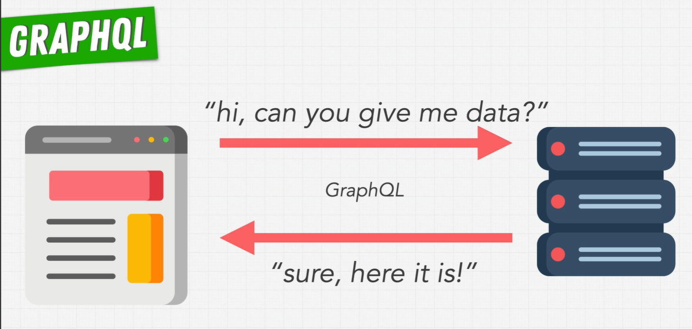

- graphql - is a query language for your API
- always describe the data you with a schema
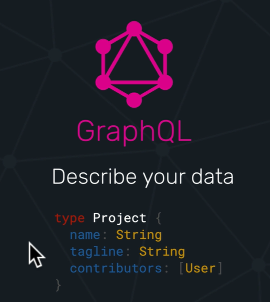
- graphql has own type system
- automating generated documentation for your API
- 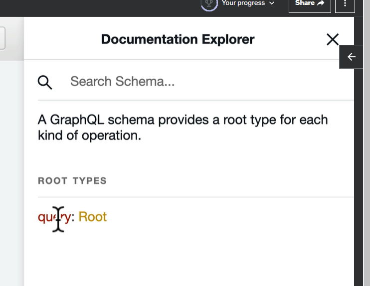

## Why use GraphQL

- Rest ful API
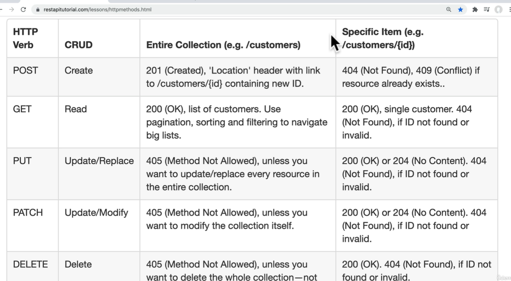

    **GraphQL API use only one endpoint**
- It call it the one GraphQL endpoint

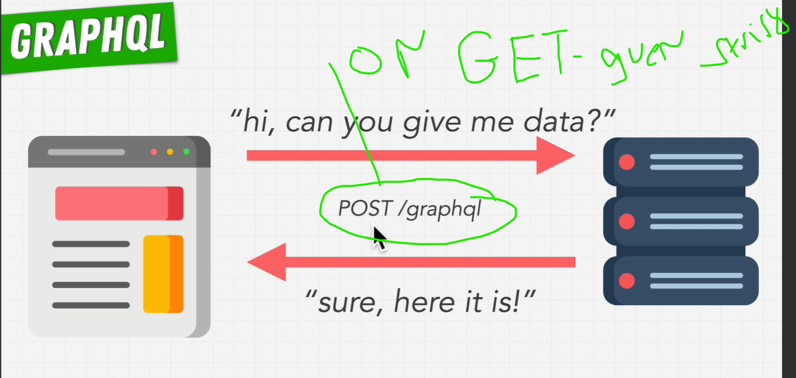

## Query

- Query - is a read operation
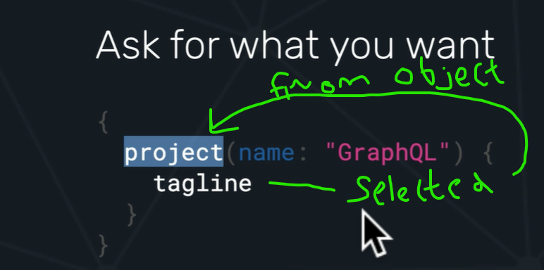

- Get predictable results
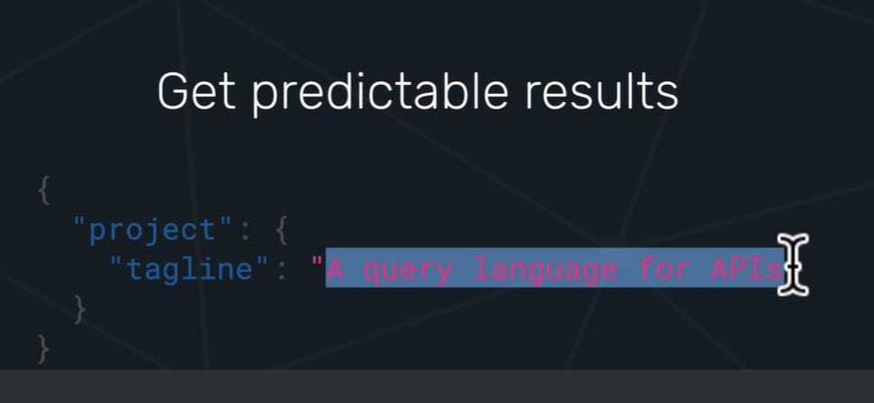

## Use Query by multiple pace of data

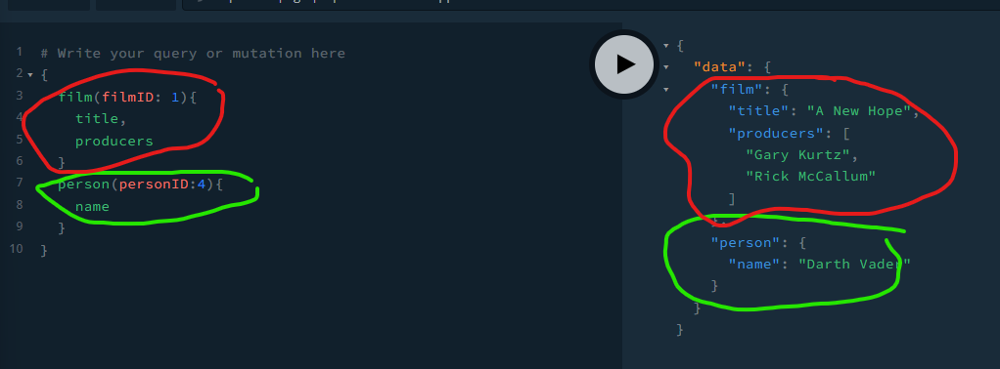

## Compare GraphQL to REST

- there's two main problems that this single endpoint solves:
  1. over-fetching of data
  2. under-fetching of data

### Perfect example for e-commerce application (online store)

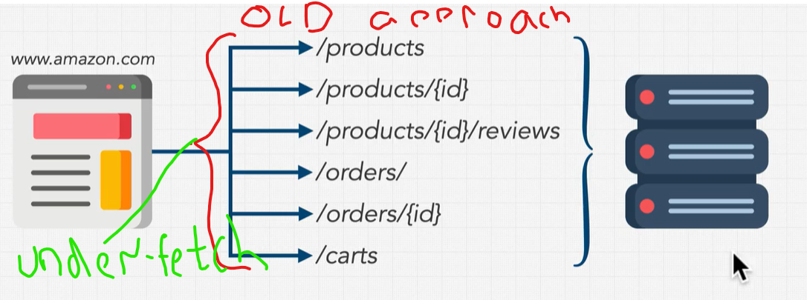

- over-fetching of data - when you get more data than you need form the server
- under-fetching of data - when you don't get enough data from the server

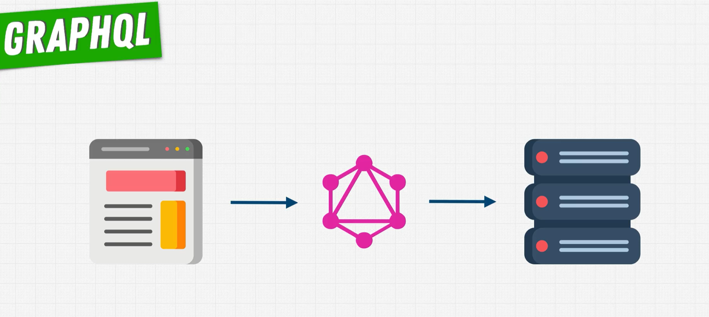

- grab the data you need (using functions calls resolvers)
- we no longer have to make multiple requests to the server to get the data we need
- net work question is faster and more efficient

### Compare Rest and Restful API

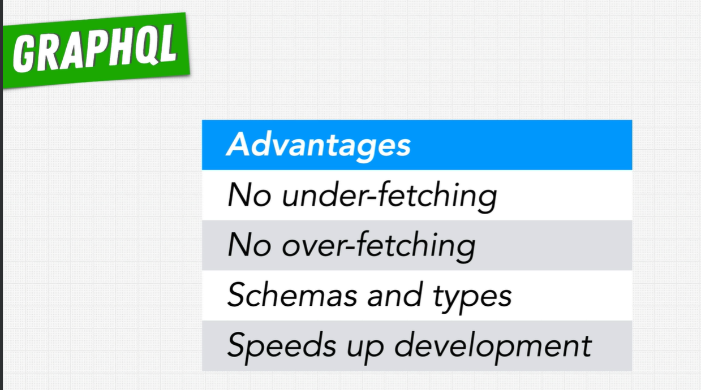

Advantages of GraphQL:

- No under fetching of data (all comes for a single request)
- No over fetching of data (only get the data you need)
- Speeds up development (no need to make multiple requests to the server)
- Schema and types (automatically generated documentation for your API)

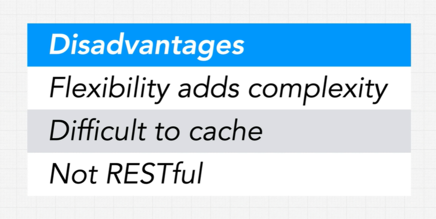

Disadvantages of GraphQL:

- Flexibility (can be a disadvantage)
- Difficult cache (we need to look the query to cache all the fields for all the most common queries)
- Not Restful (many tools won't support GraphQL)
