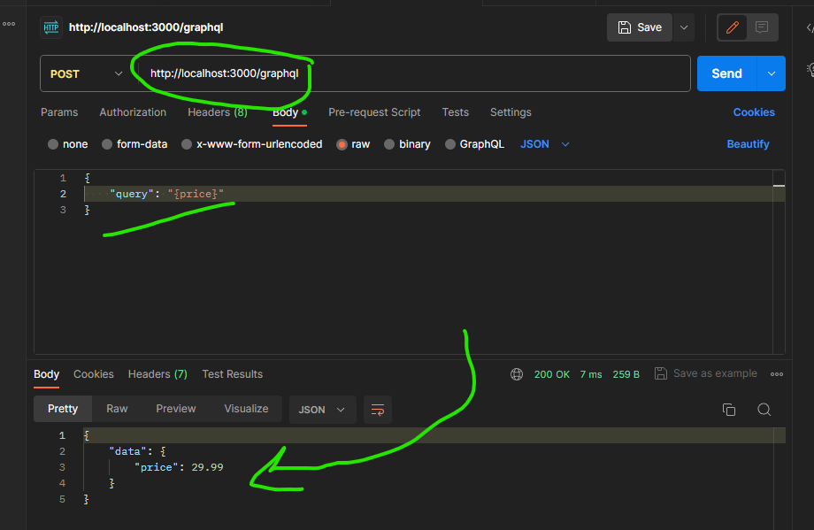
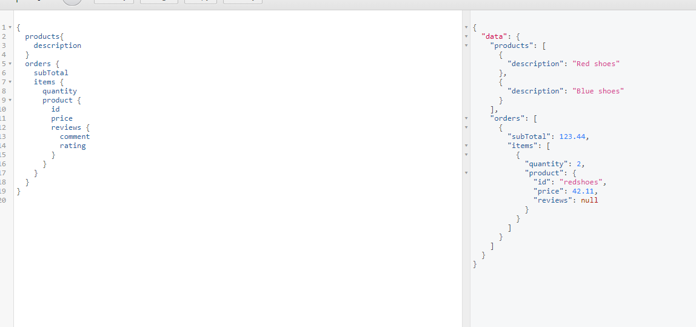
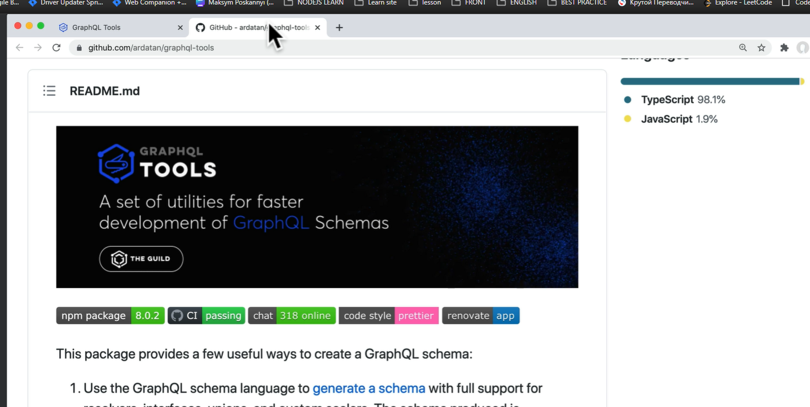

# Implementation

[Documentation](https://spec.graphql.org/draft/)

## JavaScript reference implementation

- Frontend Libraries
  - [Apollo Client](https://www.apollographql.com/docs/react/)
  - [Relay](https://relay.dev/)

### Init project

```bash
npm init -y
npm install graphql@15.3.0
npm install express
npm install express-graphql # middleware for express
```

### Create a server

```javascript

const schema = buildSchema(`
    type Query {
        description: String
        price: Float
    }
`);

const root = {
    description: "Red Shirt",
    price: 29.99
}

app.use("/graphql", graphqlHTTP({
    schema: schema,
    rootValue: root,
}));
```

### Postman for testing



## Tool for testing GraphiQL

- is a Frontend application
- this tool already included out of the box with graphql package

### added to the server

```javascript

app.use("/graphql", graphqlHTTP({
    graphiql: true
}));
```

### Build Schema

- `price: Float!` graphql the type system that it supports unique identifiers or Ids
- `id: ID!` it a special qraphql type that is used to identify objects

``` javascript
const schema = buildSchema(`
   type Query {
        products: [Product]
        orders: [Order]
    }

     type Product {
        id: ID!
        description: String!
        reviews: [Review]
        price: Float!
    }

    type Review {
        rating: Int!
        comment: String
    }

    type Order {
        date: String!
        subTotal: Float!
        items: [OrderItem]
    }

    type OrderItem {
        product: Product!
        quantity: Int!
    }
`);



```

## GraphQL Tools

<https://the-guild.dev/graphql/tools>

- used under the hood by the Apollo graphical framework
- available as a standalone package


## Executable Schemas

``` bash
npm install @graphql-tools/schema
npm install @graphql-tools/load-files
```

``` javascript
import { makeExecutableSchema } from '@graphql-tools/schema';
```

- contain array of schema strings

``` bash
npm install @graphql-tools/load-files
```

``` javascript
const typesArray = loadFilesSync('**/*', {
    extensions: ['graphql'],
});

const schema = makeExecutableSchema({
    typeDefs: [typesArray]
})
```
