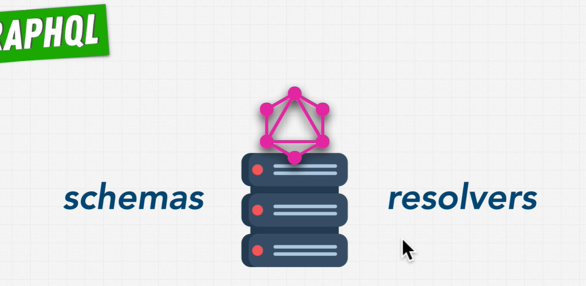
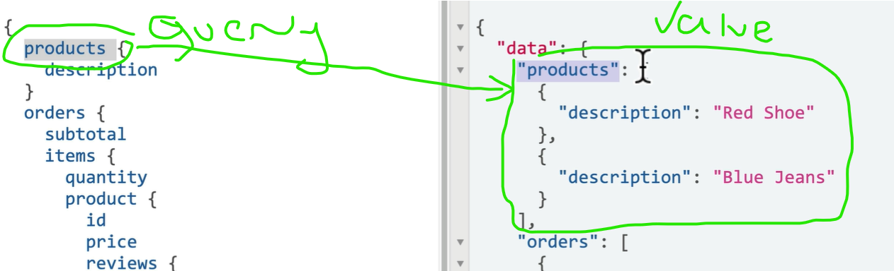
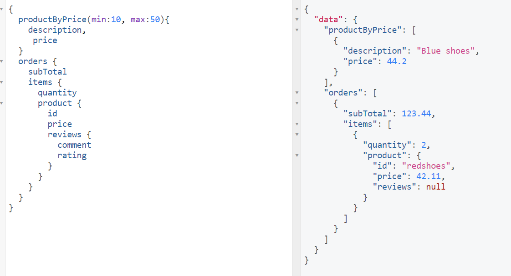

# Implementation

[Documentation](https://spec.graphql.org/draft/)

## JavaScript reference implementation

- Frontend Libraries
  - [Apollo Client](https://www.apollographql.com/docs/react/)
  - [Relay](https://relay.dev/)

### Init project

```bash
npm init -y
npm install graphql@15.3.0
npm install express
npm install express-graphql # middleware for express
```

### Create a server

```javascript

const schema = buildSchema(`
    type Query {
        description: String
        price: Float
    }
`);

const root = {
    description: "Red Shirt",
    price: 29.99
}

app.use("/graphql", graphqlHTTP({
    schema: schema,
    rootValue: root,
}));
```

### Postman for testing


## Tool for testing GraphiQL

- is a Frontend application
- this tool already included out of the box with graphql package

### added to the server

```javascript

app.use("/graphql", graphqlHTTP({
    graphiql: true
}));
```

### Build Schema

- `price: Float!` graphql the type system that it supports unique identifiers or Ids
- `id: ID!` it a special qraphql type that is used to identify objects

``` javascript
const schema = buildSchema(`
   type Query {
        products: [Product]
        orders: [Order]
    }

     type Product {
        id: ID!
        description: String!
        reviews: [Review]
        price: Float!
    }

    type Review {
        rating: Int!
        comment: String
    }

    type Order {
        date: String!
        subTotal: Float!
        items: [OrderItem]
    }

    type OrderItem {
        product: Product!
        quantity: Int!
    }
`);


```

## GraphQL Tools

<https://the-guild.dev/graphql/tools>

- used under the hood by the Apollo graphical framework
- available as a standalone package


## Executable Schemas

``` bash
npm install @graphql-tools/schema
npm install @graphql-tools/load-files
```

``` javascript
import { makeExecutableSchema } from '@graphql-tools/schema';
```

- contain array of schema strings

``` bash
npm install @graphql-tools/load-files
```

``` javascript
const typesArray = loadFilesSync('**/*', {
    extensions: ['graphql'],
});

const schema = makeExecutableSchema({
    typeDefs: [typesArray]
})
```

## Resolvers




- used to resolve the data for the fields in the schema
- it is a function that returns the data for a field in the schema

- `parent` - returned value from the root
- `args` - if need parameterized queries (if we want to filter the data)
- `context` - useful for data that's shared across all resolvers
    ( example: witch use is login information, authentication information, etc.)
- `info` - the information about the execution state of the server

``` javascript
const resolvers = {
    Query: {
        products: (parent, args, context, info ) => {
           console.log("Getting products...")
            const product = await Promise.resolve(parent.products);
            return product;
        },
        orders: () => {
            return orders;
        }
    }
}
```

### Structure of the resolvers

- separate file for each type of resolver
- each file contains a resolver for each field in the type

``` javascript
const products = [
    {
        id: "redshoes",
        description: "Red shoes",
        price: 123.44,
    },
    {
        id: "blueshoes",
        description: "Blue shoes",
        price: 44.2,
    },
]

function getAllProducts() {
    return products;
}

module.exports = {
    getAllProducts
}
```

``` javascript
const productsModel = require('./products.data');

module.exports = {
    Query: {
        products: async () => {
            return productsModel.getAllProducts();
        }
    }
}
```

## Filtering with Queries and resolvers



``` javascript
function getAllProductsByPrice(min, max) {
    return products.filter(product => product.price > min && product.price <= max);
}
```

- `productByPrice` - query that returns products within a price range
- `minPrice!` - minimum price (required)
- `maxPrice!` - maximum price (required)
- `Product` - type of the return value

``` graphql
    type Query {
       products: async () => {
            return productsModel.getAllProducts();
        },
        productsByPrice: (parent, args) => {
            return productsModel.getAllProductsByPrice(args.min, args.max);
        }
    }
```

``` graphql
   type Query {
        products: [Product]
        productByPrice(min: Float, max: Float): [Product]
    }
```
