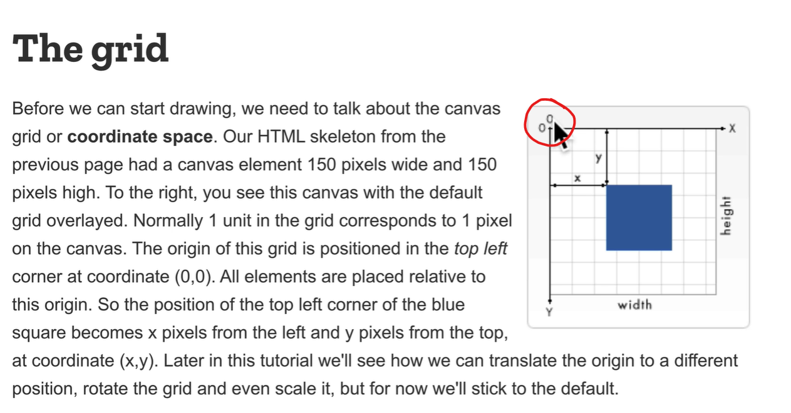
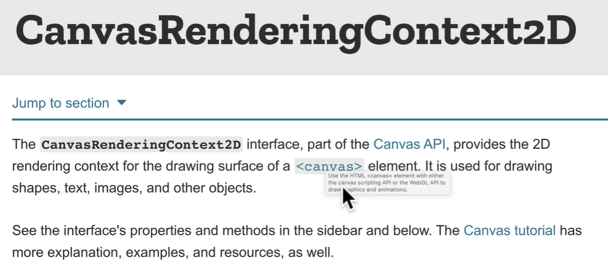
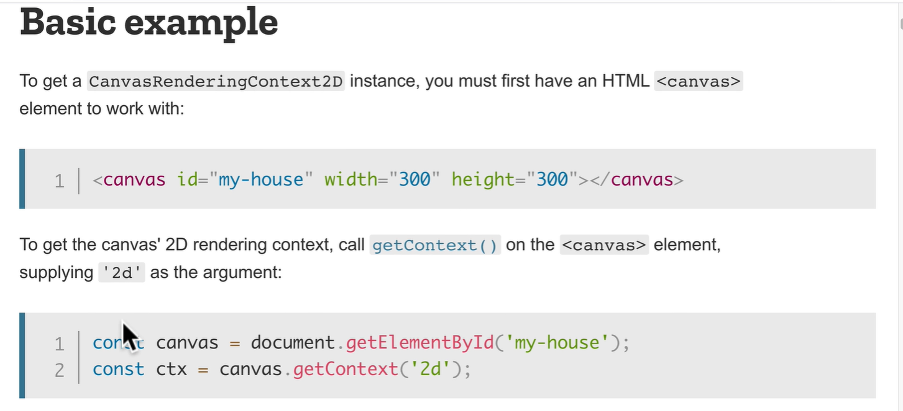

# Overview

- [Overview](#overview)
  - [Canvas](#canvas)
    - [Drawing](#drawing)
    - [CanvasRenderingContext2D](#canvasrenderingcontext2d)

## Canvas

<https://developer.mozilla.org/en-US/docs/Web/API/Canvas_API/Tutorial/Drawing_shapes>

- canvas can used for both 2D and 3D graphics

- The grid is a 2D array of `0`s and `1`s.

### Drawing

fillRect(x, y, width, height) - fills a rectangle

### CanvasRenderingContext2D

<https://developer.mozilla.org/en-US/docs/Web/API/CanvasRenderingContext2D>

- The CanvasRenderingContext2D interface is used for drawing rectangles, text, images and other objects onto the canvas element.

