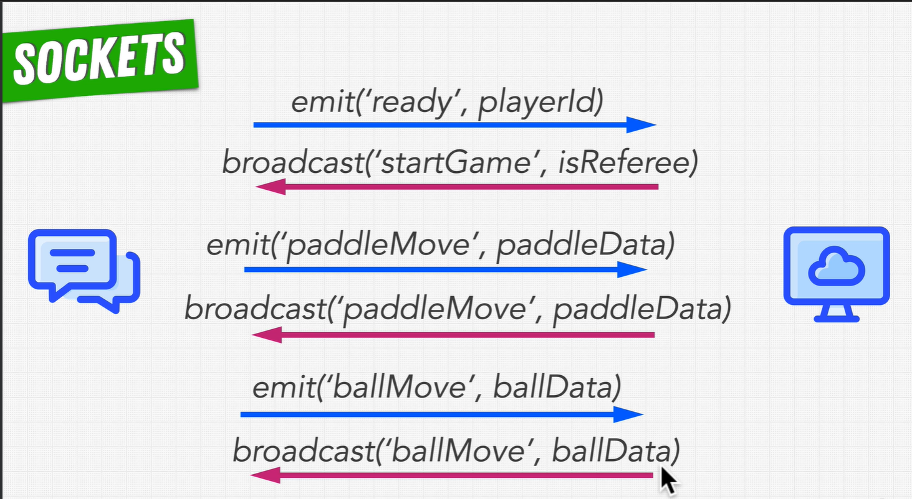

# Implementation of Socket functionality

- [Implementation of Socket functionality](#implementation-of-socket-functionality)
  - [Message Sequence Game](#message-sequence-game)

## Message Sequence Game

1. send -> emit("ready")
Server emits a "ready" event to the client with the playerId.
2. response server -> broadcast("startGame", isReferee)
3. send -> emit("paddleMove", paddleData)
Client emits a "paddleMove" event to the server with the paddleData.
4. response server -> broadcast("ballMove", ballData)
Server emits a "ballMove" event to all clients with the ballData.
5. send -> emit("ballMove", ballData)
Client emits a "ballMove" event to the server with the ballData.
6. response server -> broadcast("ballMove", ballData)
Server emits a "ballMove" event to all clients with the ballData.

- Keeping track of the game state, understanding the boundaries of the game >>>>> will take on the client
