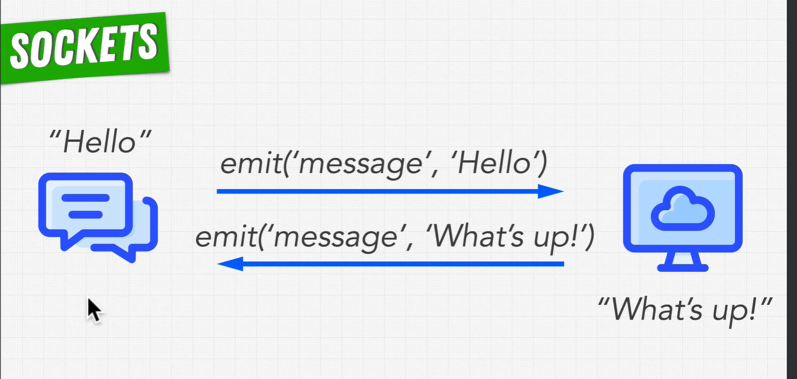

# Fundamentals for Sockets

- [Fundamentals for Sockets](#fundamentals-for-sockets)
  - [Polling](#polling)
  - [Sockets](#sockets)
  - [Sockets VS Polling](#sockets-vs-polling)
    - [Web Sockets is a protocol a way of sending messages over the internet](#web-sockets-is-a-protocol-a-way-of-sending-messages-over-the-internet)
    - [libraries for web sockets](#libraries-for-web-sockets)
  - [Socket.IO](#socketio)
    - [Server Side socket.io](#server-side-socketio)
    - [Server api](#server-api)
    - [Client Side socket.io-client](#client-side-socketio-client)

## Polling

- you make a request to the server every x seconds

```javascript
setInterval(() => {
  fetch('http://localhost:3000')
    .then(response => response.json())
    .then(data => console.log(data))
}, 1000)
```

## Sockets

- an opening or hollow that forms a holder for something
- holder for data to be sent and received between two computers


- internet protocol sockets (IP sockets)
- datagram sockets (UDP) low latency
- TCP sockets (Transmission Control Protocol) if need connection before you can send data, reliable
- HTTP sockets (HyperText Transfer Protocol) on top of TCP

- web sockets (WS) on top of HTTP
This is a javascript feature that allows two way communication between the client and the server.

## Sockets VS Polling

### Web Sockets is a protocol a way of sending messages over the internet



- sockets open channels of communication between the client and the server and allow for real time communication

### libraries for web sockets

1. ws: a node.js WebSocket library (link)<https://www.npmjs.com/package/ws>
    - this module does not work in the browser. browser clients must use the native WebSocket object.
2. socket.io: a library that enables real-time, bidirectional and event-based communication between the browser and the server. (link)<https://socket.io/>
    - this module works in the browser and in node.js

    - socket io is a guaranteed to hove your application run on all devices

## Socket.IO


### Server Side socket.io

- allows you to connect multiple clients at the same time

- need to support some addition functionality over the client
  - keep track of all the clients that are connected
  

### Server api

- use the node event emptier pattern


### Client Side socket.io-client

- allows you to connect only one server
