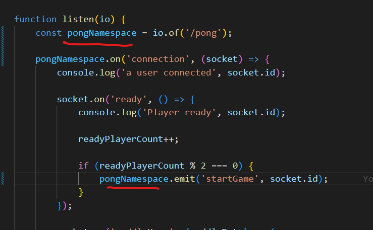

# Main info about namespaces in socket.io

## What is a namespace?

- Is a communication channel that allows you to split the logic if your application over a single shared connection.

- allows to create different channels for different purposes ( for example, chat, game, etc.)

## How to create a namespace?

