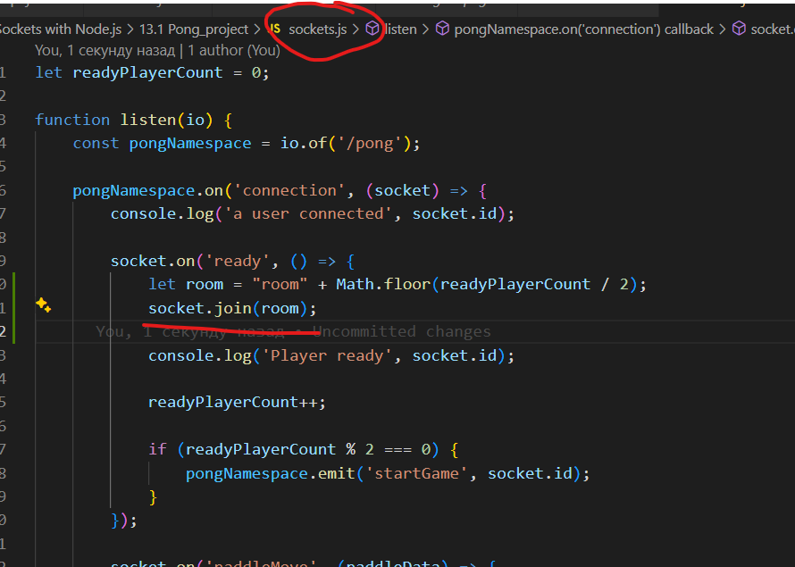

# Main info about rooms in socket.io

## What is a room?

- Is a communication channel that allows you to split the logic if your application over a single shared connection.

## How to create a room?

