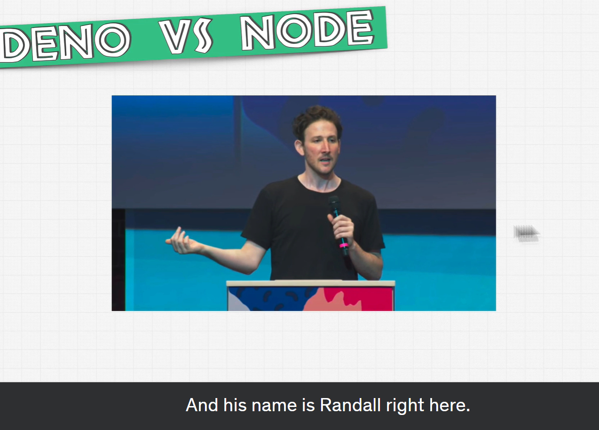
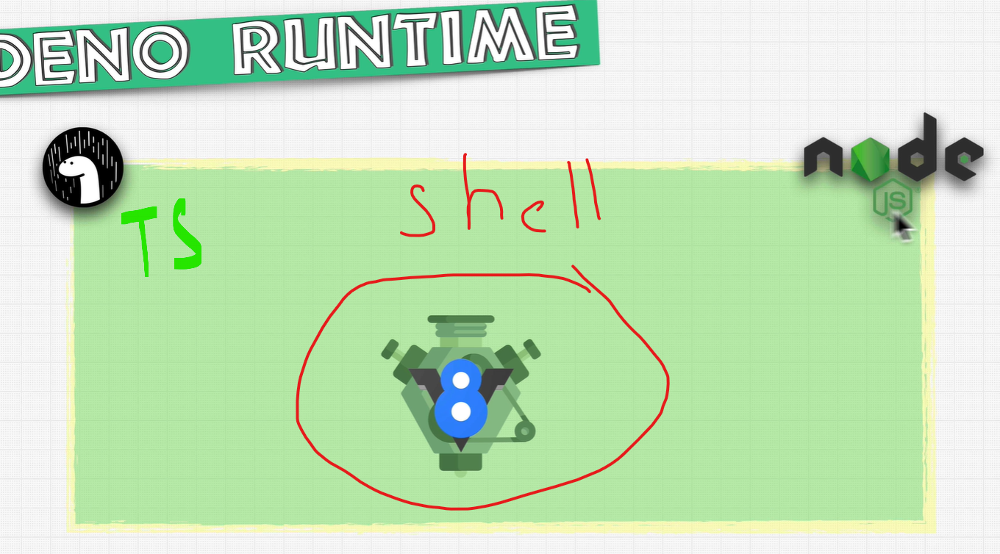

# Fundamentals Deno VS Node.js

- [Fundamentals](#fundamentals-deno-vs-nodejs)
    [Deno](#deno)

## Deno

- Ryan Dahl, the creator of Node.js, announced Deno in 2018.
- Deno is a runtime for JavaScript and TypeScript that is based on the V8 JavaScript engine and the Rust programming language.

## Why deno?

