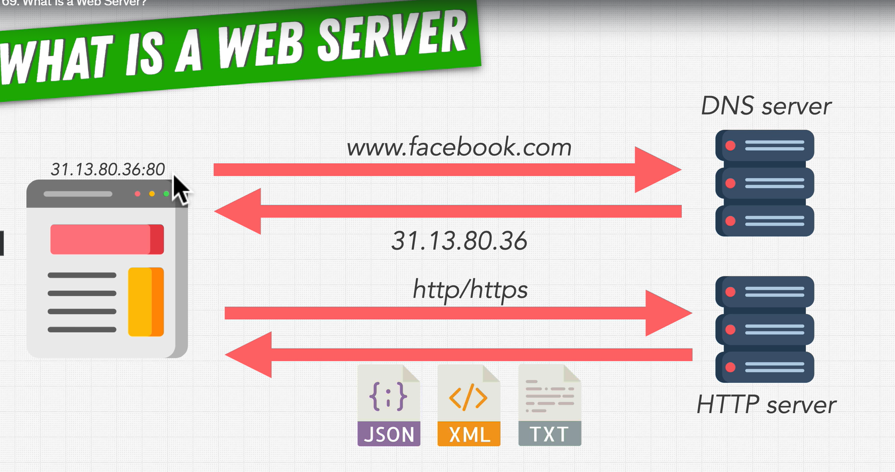
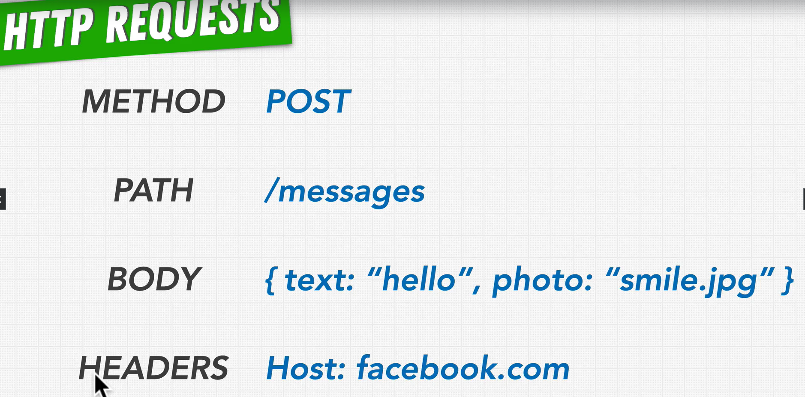

# Fundamentals

1. webBrowser -> <www.facebook.com> -> DNS sever (domain name system) -> api address -> 31.13.80.36
2. api address -> 31.13.80.36 -> HTTP sever (hyper text transfer protocol)
3. HTTP sever running on prot 80 31.13.80.36:80 -> send Json, xml, txt -> webBrowser

## API - application programming interface (two application to talk to each other)

## HTTP RESPONSE

1. headers -> Content-Type: application/json
2. BODY
3. Status code:
   1. Continue response indicate that everything so far is OK 100 ... 199
   2. 200 successfully ... 299
   3. redirects 300 ... 399
   4. client errors 400 ... 499
   5. Server errors 500 ... 599
