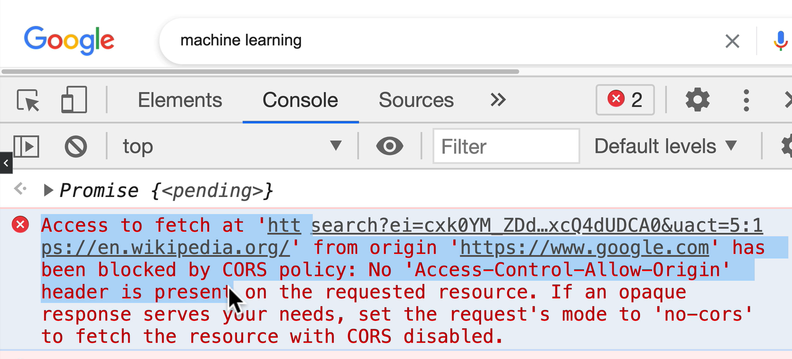
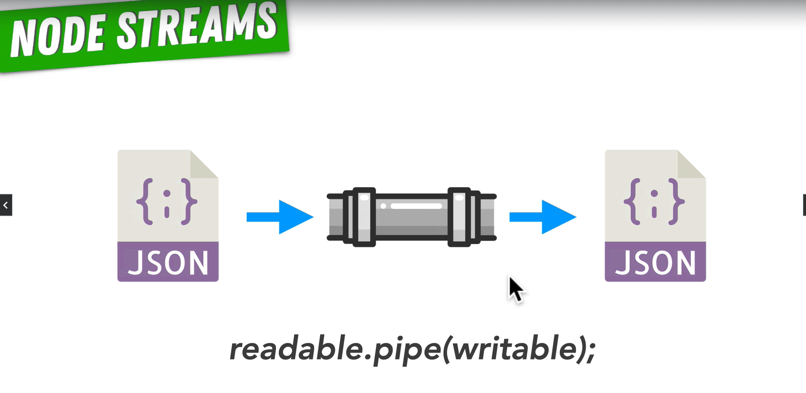

# Fundamentals

1. webBrowser -> <www.facebook.com> -> DNS sever (domain name system) -> api address -> 31.13.80.36
2. api address -> 31.13.80.36 -> HTTP sever (hyper text transfer protocol)
3. HTTP sever running on prot 80 31.13.80.36:80 -> send Json, xml, txt -> webBrowser

## API - application programming interface (two application to talk to each other)

## HTTP RESPONSE

1. headers -> Content-Type: application/json
2. BODY
3. Status code:
   1. Continue response indicate that everything so far is OK 100 ... 199
   2. 200 successfully ... 299
   3. redirects 300 ... 399
   4. client errors 400 ... 499
   5. Server errors 500 ... 599

## ORIGIN <https://www.example.com:443/map>

1. combination of 3 things

   1. Protocol-> https:
   2. Host -> www.example.com // which sever will be handling in request
   3. Prot -> :443

2. Same origin policy
   1. 

## CORS

1. C -> Cross
2. O -> origin
3. R -> resource
4. S -> sharing

Response header -> access-control-origin: \*
// white list:
Access-Control-Allow-Origin: <https://www.google.com> || \* (allow all)

## Submit data to server

1. Use POST or PUT methods

## Request and Response as Stream

1. User req.pipe(response) 
