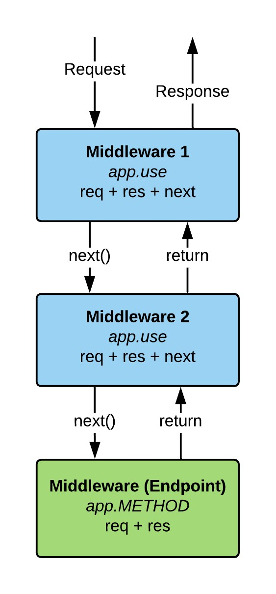

# Fundamentals EXPRESS

## EXPRESS

1. LoopBack 4 -> extending framework with express
2. Koa -> creator express (modern express)
3. NextJS -> framework simplify react integration
   1. Netflix, Github
   2. Server Side rendering
   3. Use for react only

## TOOLS

1. POSTMAN
2. INSOMNIA -> simpl to use user interface
3. npm i nodemon --save-dev

## MIDDLEWARE

## Model-view-controller (MVC)

How to organize various different pieces of code

1. MODEL -> added removing data from database (database)

2. VIEW -> If model updated view updated also (digrams, html... )

3. CONTROLLER -> User use controller for making requests and manipulates model accordingly

This approach allows use reade, updated, and remove code more easier.
Each lear is responsible for one thing.
