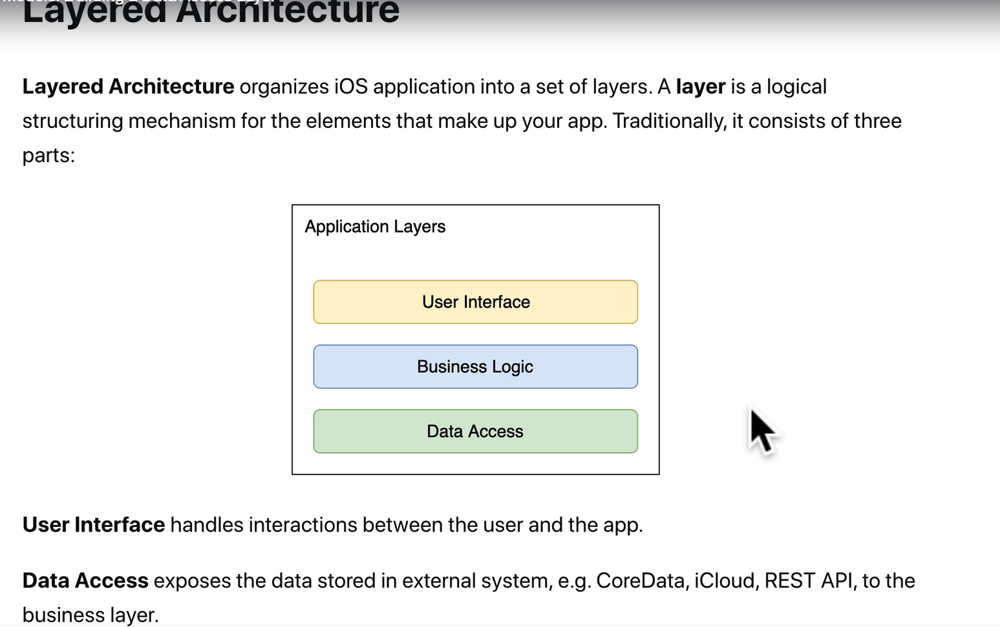

# info

## package json scripts

1. if need run code in other folder,

```javascript
  "scripts": {
    "server": "cd server && npm run watch",
    "client": "cd server && npm start",
  },
```

```javascript global file
 "scripts": {
    "install-sever": "npm install --prefix server", // install packages for server
    "install-client": "npm install --prefix client",  // install packages for client
    "install": "npm run install-server && npm install-client",  // install for both client and server
    "server": "npm run watch --prefix server", // --prefix run npm command in a different folder
    "client": "npm start --prefix client", // --prefix run npm command in a different folder
    "deploy":"npm run build --prefix client && npm start --prefix server",
    "watch": "npm run server & npm run client", // run left and right command side by side
  },
```

```javascript server client side
 "scripts": {
    "build": "BUILD_PATH=../server/public react-scripts build" // build in server folder ^4.0.0.0
  },
```

## morgan package

1. npm package
2. if need logging requests

## layered Architecture 

## Separation of concerns

1. <https://nalexn.github.io/separation-of-concerns/>
2. <https://en.wikipedia.org/wiki/Separation_of_concerns>

## Architecture diagram


## Don't be a junior

Link: <https://zerotomastery.io/blog/dont-be-a-junior-developer-the-roadmap>
