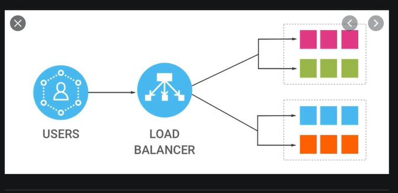
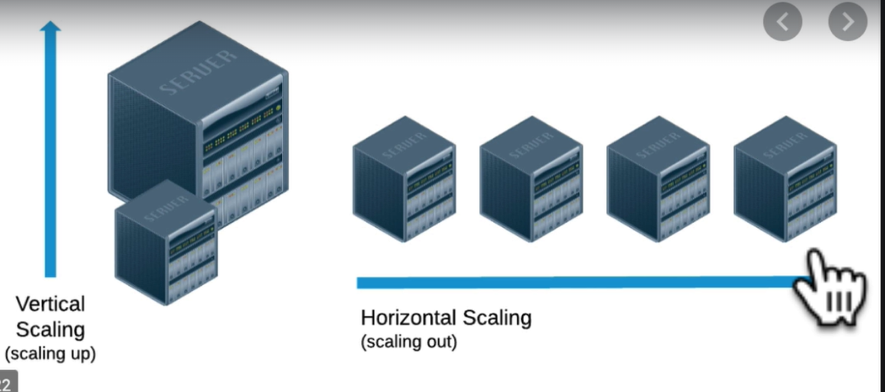
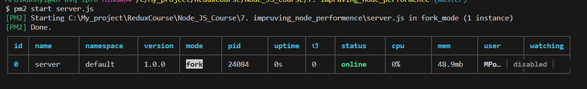
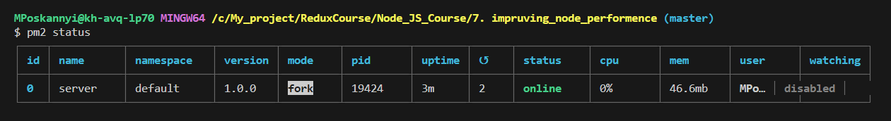
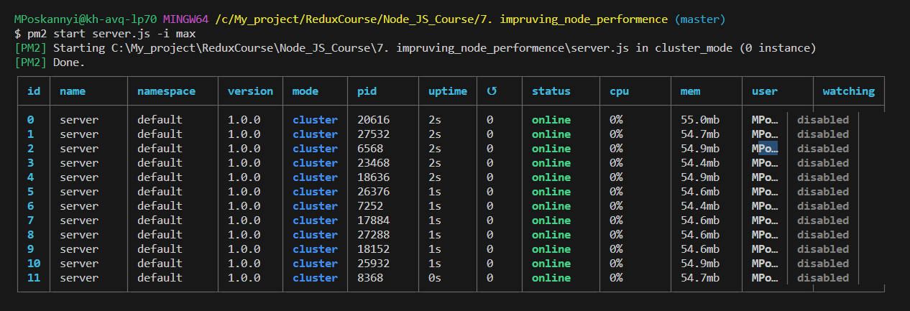
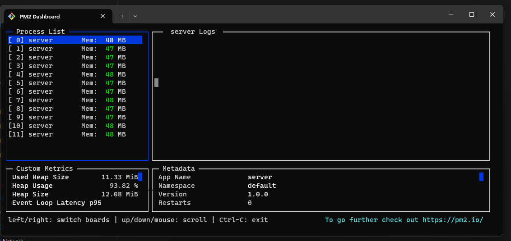

# Fundamentals

If event loop in node.js is blocking for example setTimeout

1. We can't load other tab
2. If we try to load other tab we wait when event loop will be unlocked after that we starting load other tab
3. The same behavior do JSON.stringify({}) || JSON.parse("{}")

Normal response time 200 - 300 milliseconds

Improving node performance

One process run a single thread.
Run multiple node processes run side by side.

## USE Cluster Module in Node

Run your code side by side in parallel

1. Round robin approach:
   If we have 2 workers and we have three request.
   First first worker take first request, second worker take second request.
   Third request take first worker.3
   

   Notice behavior browsers that:

   If you try send 2 same request at nearly the same time.
   It waits for the first request to complete before it even tries to make the second request.
   So that it can potentially reuse their response if the response is saved to your browser's cache.

2. Randomized static approach:
   Each new request is assigned to one of the processes at random

Use "os" Module
If need create correct number of worker processes
Each process needs to use a separate processor in your computer in your CPU
NUM_WORKERS = os.cpus().length;

## Load balancing

1. Vertical scaling -> add more speed CPU
2. Horizontal scaling -> adding more servers (more node processes)
   

## PM2 Tool <https://pm2.keymetrics.io/docs/usage/cluster-mode/>

Running in production
Running in a background process
Cant create cluster process

Base commands:

1. pm2 start server -> start our server process
   
2. pm2 list || pm2 ls || pm2 status -> get current status server
   
3. pm2 stop server -> stop our server process
   pm2 stop 0 -> stop individual processes
4. pm2 delete server

5. pm2 start server.js -i 2 <----> -i it measures the amount of worker processes that will be created in our cluster.
   pm2 start server.js -i 2 -> 2 workers
   pm2 start server.js -i max -> maximum number of workers
   

6. pm2 logs -> get a real time view of what's being logged in our server right now.
   pm2 logs --lines 200 -> for the last 200 saved lines if logs

7. pm2 restart server

8. pm2 start server.js -l logs.txt -i max -> send logs to logs.txt

9. pm2 show 0 -> get information about each of these processes

10. pm2 monit ->
    
