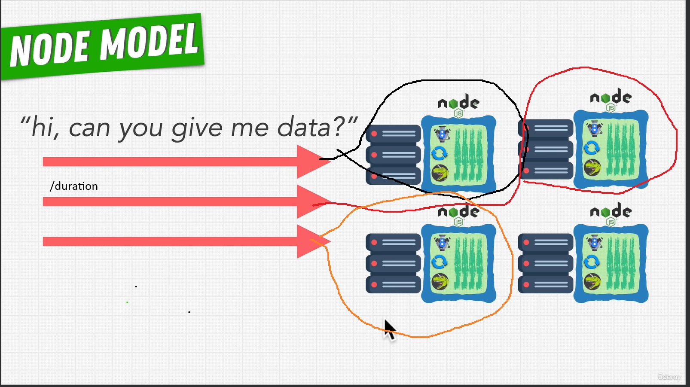
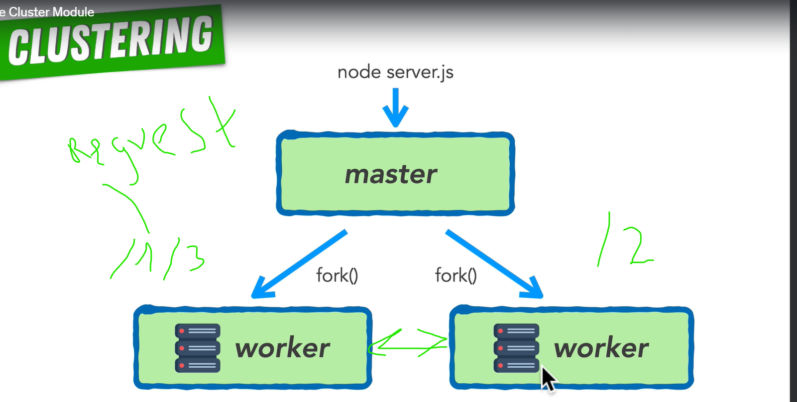

# Fundamentals

If event loop in node.js is blocking for example setTimeout

1. We can't load other tab
2. If we try to load other tab we wait when event loop will be unlocked after that we starting load other tab
3. The same behavior do JSON.stringify({}) || JSON.parse("{}")

Normal response time 200 - 300 milliseconds

Improving node performance

One process run a single thread.
Run multiple node processes run side by side.

## USE Cluster Module in Node

Run your code side by side in parallel

1. Round robin approach:
   If we have 2 workers and we have three request.
   First first worker take first request, second worker take second request.
   Third request take first worker.3
   
