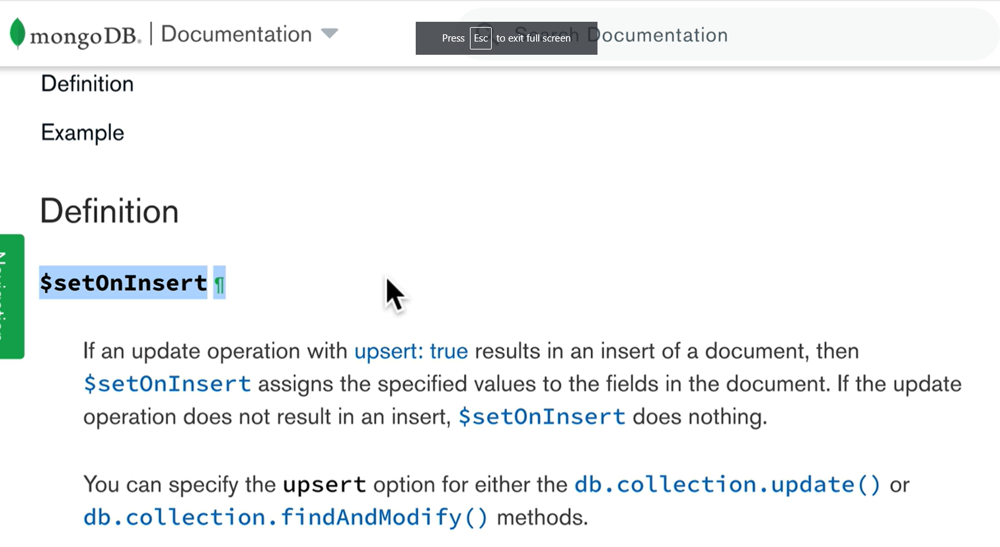
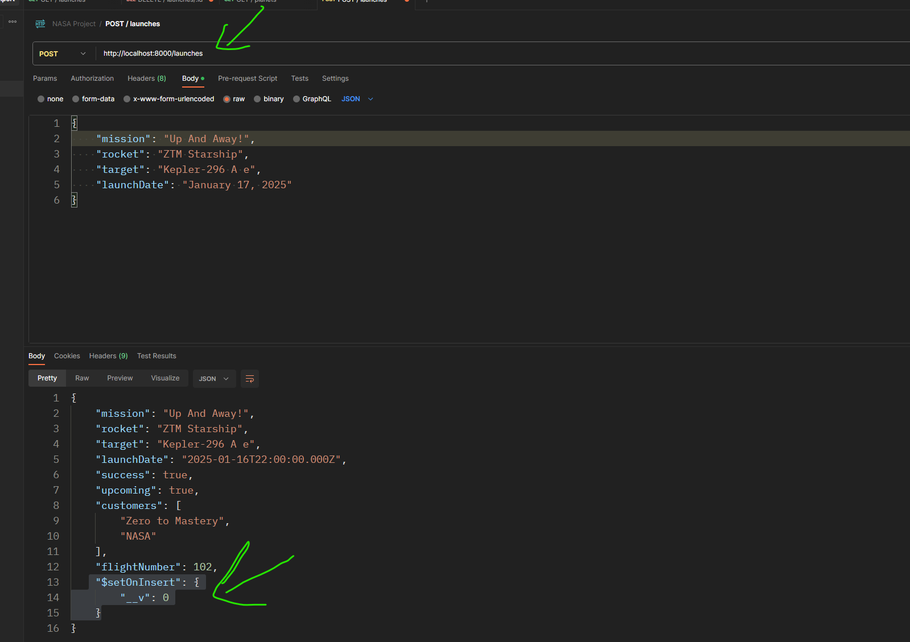
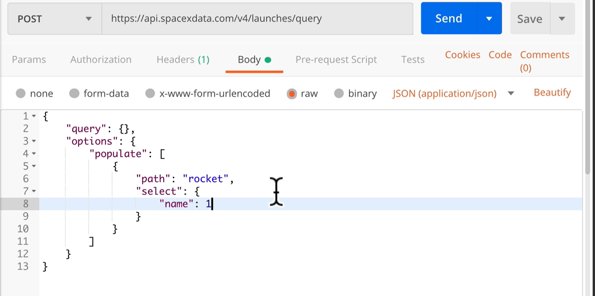

# Fundamentals

- node best practice <https://github.com/goldbergyoni/nodebestpractices>

Type DataBase:

1. Relational -> SQL, MySQL, and PostgresSQL
2. Document -> MongoDB
3. KeyValue -> Redis
4. Graph model -> Social Network
5. Wide-column -> NoSQL database

============= MongoDB vs Postgres ================

|  DB             | MongoDB     | Postgres      |
| :---            |    :----    |       ---:    |
| type:           | Document    |  Relational   |
| Organized into: | Collections |  Tables       |
| Query language: | NoSQL       |  SQL          |
| Scaling factor: | Horizontal  |  Vertical     |
| Schema:         | Flexible    |  Rigid        |

============= MongoDB vs Postgres ================

## Scaling DB

## ACID - transactions

- fully read data
- data not lost
- only one option or read or no
- ___
- ___

## ============= MongoDB =============

## Mongoose

1. Elegant mongoDb object modeling node.js

- Schema validation: String | Number | ...

## Data structure in mongoDbo

- ObjectId -> uniq id
- __v -> version key :
  1. If need updated Schema
  2. manage document with old data -> in sequel db need use database migration

## Referential integrity in a Sequel

1. If foreign key was broken
2. Mongo don't support foreignKey -> ned use additional verifications

## Auto_increment support

1. easy implementation in sequel databases <https://dev.mysql.com/doc/refman/8.0/en/example-auto-increment.html>
2. In mongo db not easy

## $setOnInsert in mongoDb 

## Post method

1. If need use in request body some additional data for receive data from server

## dotenv package

1. In file .env take values and insert into process.env -> process.env.PORT  || 8000
