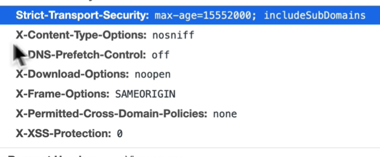

# helmet

1. helmet avoid this information

2. strict-transport-Security
this header tells browser that it should never talk to your API using http, and all http requests should be automatically converted to http s requests instead.

3. 
4. 
