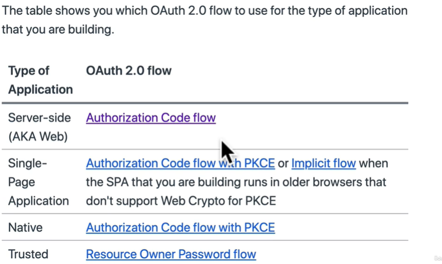

# Fundamentals Node Security + Authentication

1. tls last version of the ssl 
2. wrapping request tls encrypting 
3. If need created  ssl or tls certificate

## Authentication

when need now who this user

## Authorization

checks whether that user has permission
to access a specific resource once they've been authenticated
access control

404 permission
401 authenticate

## Api key

It's a string

passing as either a query parameter or as a header in http request
****

goole maps

## JSON Web token

two types JWT || Opaque tokes

JWT encoded information

split to three part
header -> alg (HS256) and type
payload ->
signature ->

data that's constantly being passed around from client to the server.

## The OAUTH 2.0 authentication standard

resource owner -> user
client -> my website
resource server -> your backend in your application
Authorization server -> goole service

1. has difference flows

   Server-side (AKA web)

## White passport

<https://www.passportjs.org/>

<https://www.passportjs.org/packages/passport-google-oauth20/>

Provide authenticate for node

## Cookies

1. string of data storing in our browser

Two type of using cookies

1. stateful cookies
   1. store session in DB and send to client only reference (changes when a lot of users )
   2. if need keep in our session in a secret
2. stateless cookies
   1. all the session data lives in the client

size cookies limited  about 40 kilobytes

## Session

1. Are a way of storing data about the current active user.

Storing session data:

1. Server side session -> where user data lives in the server
2. client side session -> when user data lives in the site (cookies)

npm packages:

 1. Server side session -> express-session
    1. only saves the Session ID in the cookie
    2. and session data save in DB and permission

 2. client side session -> cookies-session

Serialize its mean saving our user data to a cookie.
Deserialize loading that user data from that cookie into a value that we can read.

## Role-based access control

That allows them to do some specific set of task in our API
Store that role inside a session

[Node.js Security Cheat Sheet](https://cheatsheetseries.owasp.org/cheatsheets/Nodejs_Security_Cheat_Sheet.html)

## Github authentication

1. go to settings -> Developer Settings -> OAuth apps -> Register a new application
2. remove react strict mode
   1. Renders our application twice
   2. We get the one time code

Flow:

1. Forward the user to the github login screen. (we pass in the client ID)
2. User is now on the github side and logs in (github.com/login)
3. When user decide to login... they get forward back to local host :3000
4. BUT localhost:3000/?code=adsdasdad
5. Use the code to get the access token (code can only use once)
