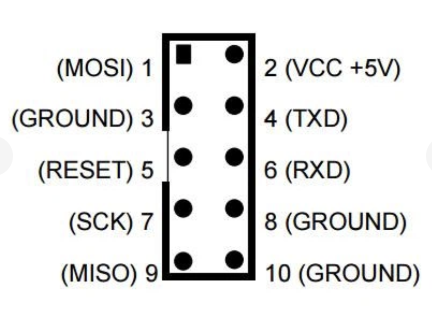

# Project 1: Robot Car

## Overview

This project involves building a simple robot car that can be controlled remotely. The car will be equipped with motors, sensors, and a microcontroller to handle the control logic.

## Controller ATMEGA16-16AI

## ADM485 (RS-485) Communication

Which boards inside the robot can be connected via ADM485 (RS-485):

- **Main Board (Brain)**
    Receives commands from the phone.

- **Motor Board**
    Controls DC/stepper motors.

- **Sensor Board**
    Handles distance, line, gyroscope, and encoder sensors.

- **Power Board**
    Monitors the battery, currents, and protections.

- **Expansion Board**
    Manages servos, relays, lights, and manipulators.

## USBASP Programmer

[USBASP Programmer](https://arduino.ua/ru/prod396-programmator-usbasp-isp-avr-v2?srsltid=AfmBOoq8O-IhCwcMwUoAVWjWoEzVAyNJzTlhzaHCUP-YwbcUw4pd1kIU)

Use the USBASP programmer to upload code to the ATMEGA16-16AI microcontroller.

