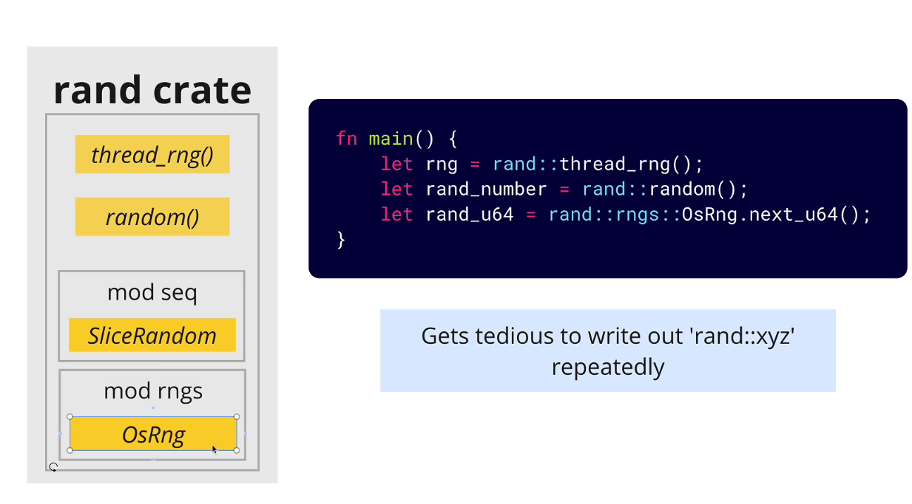

# Import modules in Rust


## Importing modules

You can import modules in Rust using the `use` keyword. The `use` keyword allows you to bring items from a module into scope so that you can use them in your code.

```rust

mod games {
    pub mod cards {
        pub fn create_deck() {
            // Create a deck of cards
        }

        pub fn shuffle_deck() {
            // Shuffle the deck of cards
        }
    }
}

use games::cards;

fn main() {
    cards::create_deck();
    cards::shuffle_deck();
}
```

## Importing Code from Creates




### Importing Items

You can import multiple items from a module using the `use` keyword. You can use the `*` wildcard to import all items from a module.

```rust
use rand::{thread_rng, Rng, random, rngs::OsRng};
use std::collections::HashMap as Map;
use std::collections::*;
use std::io::*;

fn main() {
    let mut vec = Vec::new();
    let mut input = String::new();
    let mut rng = thread_rng();
    let mut map = HashMap::new();
}
```
