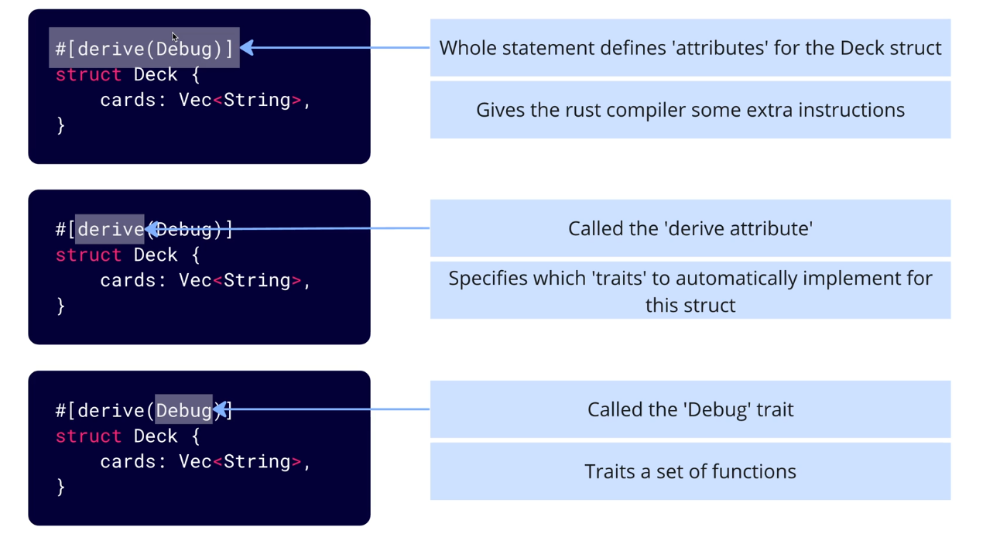

# Debugging in rust


`:?` is a debug formatter that can be used to print out the contents of a variable. This is useful for debugging and seeing what is inside a variable.

`#[derive(Debug)]`  give our rust compiler some extra instructions on how to process this struct.

`drive` - drive attribute
`Debug` - Debug trait (Traits a set of fuctions that a type must implement)

```rust
#[derive(Debug)]
fn main() {
    let dec = vec![1, 2, 3, 4, 5];
    println!("Heres your deck: {:?}", deck);
}
```
