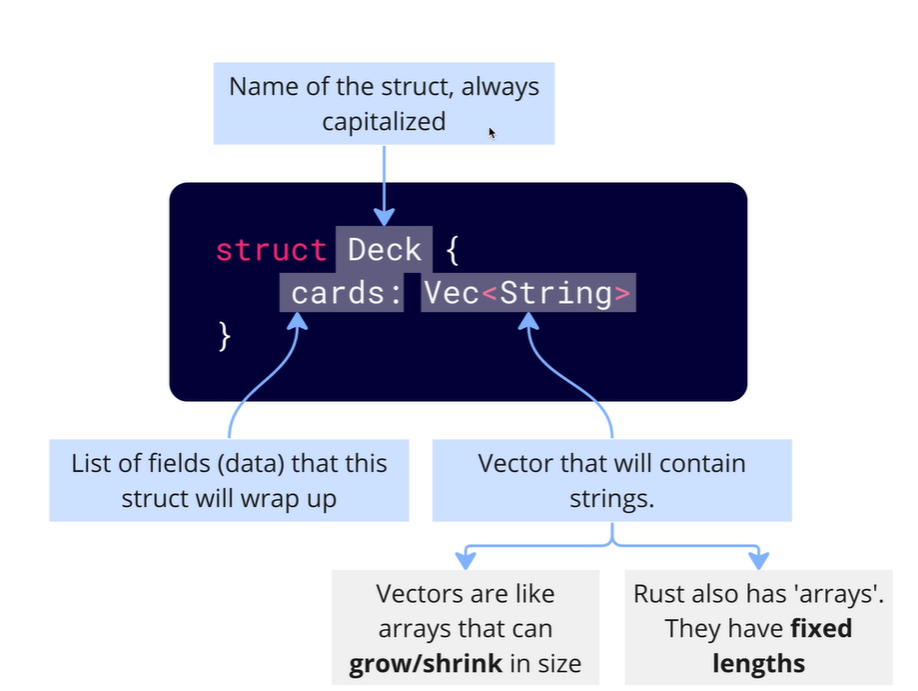
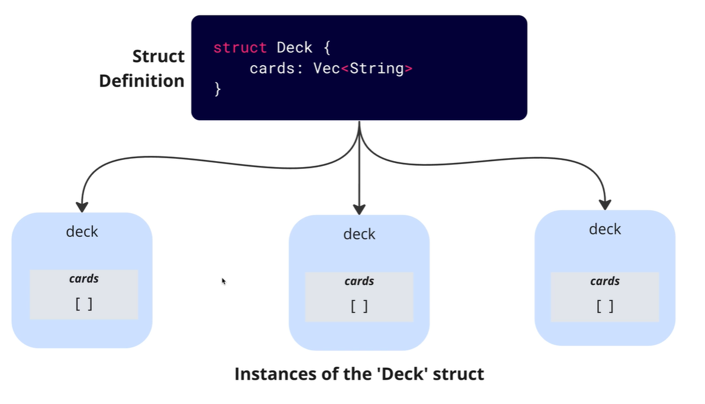
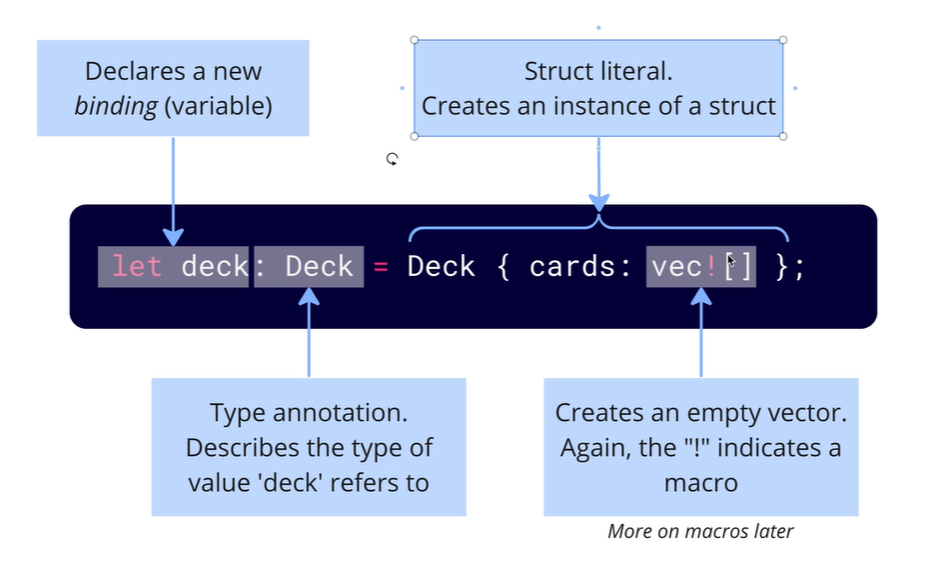
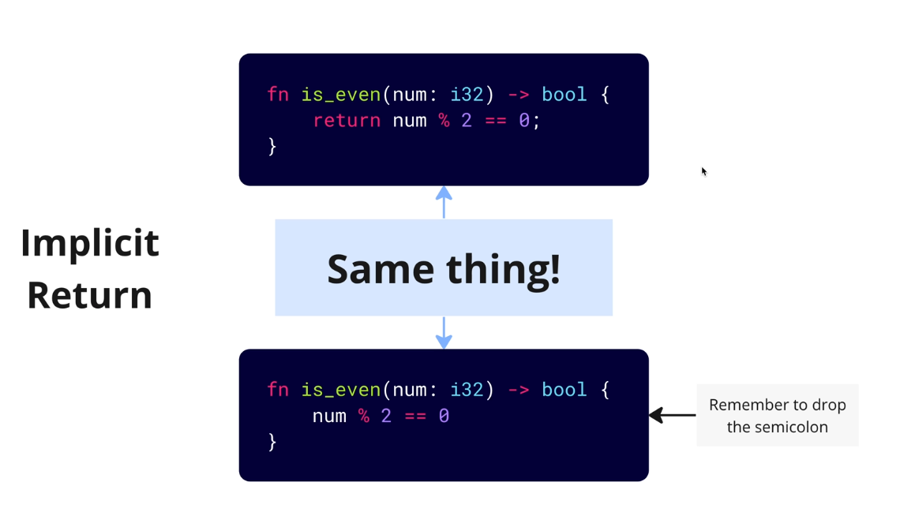

# Functions

## Function Definition

```rust

fn function_name() {
     println!("Hello, World!");
}

```

## Struct Definition like a class in other languages



`Deck` always starts with a capital letter

`Vec` is a vector, which is a dynamic array
`Vec<Card>` is a array if fixed size of `Card` struct

```rust

struct Deck {
    cards: Vec<Card>,
}

```

## Instance of a struct




`vec![]` is a macro with an empty vector/array
same as `Vec::new()`

```rust
let deck = Deck {
    let deck: Deck = Deck {cards: vec![]};
};
```

## Implicit Return



```rust

fn function_name() -> i32 {
    5 // Implicit return
}

```
