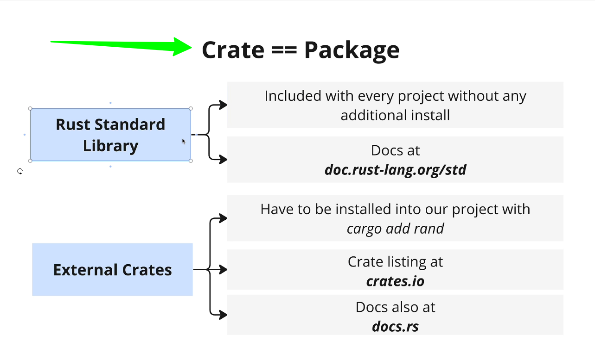

# Fundamentals concepts of Rust

- [Fundamentals concepts of Rust](#fundamentals-concepts-of-rust)
  - [Introduction](#introduction)
  - [Rust Compiler](#rust-compiler)
  - [Cargo](#cargo)
  - [Arrays VS Vectors](#arrays-vs-vectors)
  - [Installing External Crates](#installing-external-crates)
    - [Rust Standard Library](#rust-standard-library)
    - [External Crates](#external-crates)

## Introduction

Rust is a systems programming language that runs blazingly fast, prevents segfaults, and guarantees thread safety. Rust is a multi-paradigm programming language focused on performance and safety, especially safe concurrency. Rust is syntactically similar to C++, but it provides increased speed and better memory safety.

## Rust Compiler

Rust has a compiler that is written in Rust. The compiler is called rustc. The compiler is responsible for compiling the Rust code into machine code that can be executed by the computer.

## Cargo

Cargo is the package manager for Rust. It is used to compile, test, and run Rust code. Cargo is also used to manage dependencies in Rust projects.

```bash
# Check if Cargo is installed
cargo --version
# Create a new Rust project
```

## Arrays VS Vectors


Arrays and vectors are both used to store multiple values in Rust. However, there are some differences between the two.

- Arrays have a fixed size, while vectors can grow and shrink in size.
- Arrays are allocated on the stack, while vectors are allocated on the heap.

```rust
fn main() {
    // Array
    let arr = [1, 2, 3, 4, 5];
    // Vector
    let vec = vec![1, 2, 3, 4, 5];
}
```

## Installing External Crates



External crates can be installed using Cargo. Crates are libraries that can be used in Rust projects. Crates can be installed using the `cargo install` command.

```bash

# Install external crate
cargo install crate_name
```

### Rust Standard Library

The Rust Standard Library is a collection of modules that provide the core functionality of Rust. The standard library includes modules for common data structures, I/O, networking, and more. The standard library is included with the Rust compiler and does not need to be installed separately.

### External Crates

External crates are libraries that are not included in the Rust Standard Library. External crates can be installed using Cargo and added to a Rust project using the `use` keyword. External crates can be used to add additional functionality to a Rust project.

<https://crates.io/> is the official repository for Rust crates.

```rust
// Import external crate
use crate_name;
```
