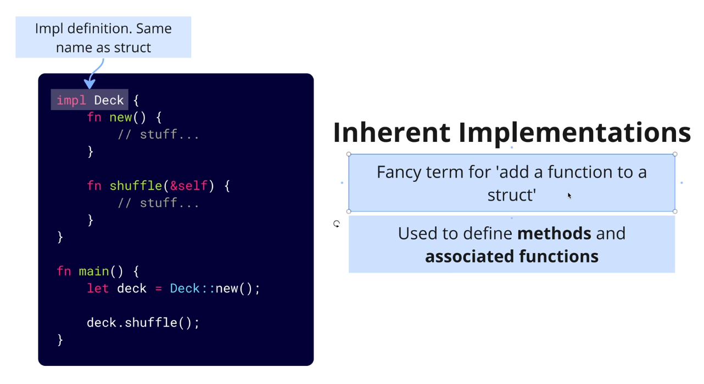
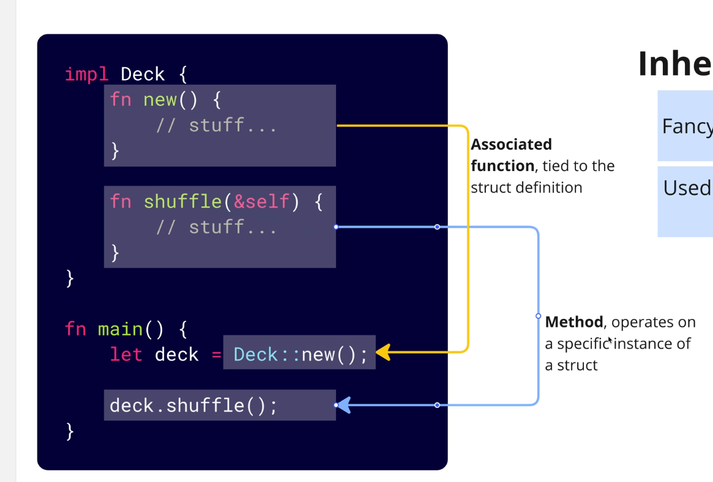

# Methods Rust

## Inheritance



`Self` is a keyword that represents the instance of the struct that we are defining methods on.

`impl` is a keyword that is used to define methods on a struct.

`fn new() -> Self` is a method that returns a new instance of the struct.

```rust
 impl Deck {
    fn new() -> Self { // Return new Instance of Deck

    }
 }

 main() {
     let deck = Deck::new();

     deck.new();
 }
```

### Associated functions VS Methods

#### Associated functions === Class methods in other languages



`&self` - is a reference to the instance of the struct that we are defining the method on.

```rust
impl Deck {
    fn new() -> Self {
        Deck {
            cards: vec![],
        }
    }

    fn print(&self) {
        for card in &self.cards {
            println!("{:?}", card);
        }
    }
}

fn main() {
    let deck = Deck::new();
}
```

#### Methods === Instance methods in other languages

```rust
impl Deck {
    fn shuffle(&mut self) {
        self.cards.shuffle(&mut thread_rng());
    }
}

fn main() {
    deck.shuffle();
}
```
