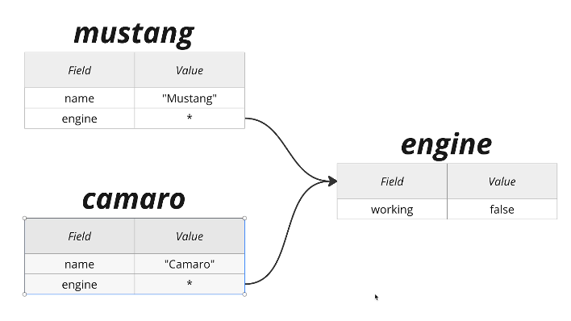

# Systems

## Main rulles of these O B L systems

## Ownership

- The system is owned by the team.

## Borrowing

- The system is borrowed by the team.

## Lifetimes

- The system has a lifetime of 1 year.
