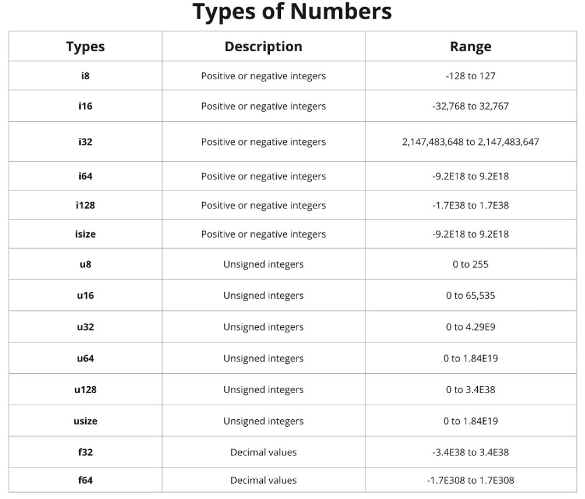

# Type Annotation in Rust

## Introduction

Type annotations in Rust are used to specify the type of a variable. This is useful when the type cannot be inferred by the compiler. Type annotations are also used to specify the type of a function parameter or return value.

## Type Of Numbers

### 3 categories of numbers

| Category        | Description                                                                 | Examples      |
|-----------------|-----------------------------------------------------------------------------|---------------|
| **Integer**     | Whole numbers, both positive and negative. They can be signed or unsigned. | i32, i64, u32, u64 |
| **Floating Point** | Numbers with decimal points. They can be 32-bit or 64-bit.               | f32, f64      |
| **Complex**     | Numbers with real and imaginary parts. They can be 32-bit or 64-bit.       | c32, c64      |

### Integer Types

| Type  | Description                  | Range                          |
|-------|------------------------------|--------------------------------|
| i8    | 8-bit signed integer         | -128 to 127                   |
| i16   | 16-bit signed integer        | -32,768 to 32,767             |
| i32   | 32-bit signed integer        | -2,147,483,648 to 2,147,483,647 |
| i64   | 64-bit signed integer        | -9,223,372,036,854,775,808 to 9,223,372,036,854,775,807 |
| u8    | 8-bit unsigned integer       | 0 to 255                      |
| u16   | 16-bit unsigned integer      | 0 to 65,535                   |
| u32   | 32-bit unsigned integer      | 0 to 4,294,967,295            |
| u64   | 64-bit unsigned integer      | 0 to 18,446,744,073,709,551,615 |

### Floating-Point Types

| Type  | Description                  | Precision                     |
|-------|------------------------------|-------------------------------|
| f32   | 32-bit floating-point number | Approximately 6-7 decimal digits |
| f64   | 64-bit floating-point number | Approximately 15-16 decimal digits |

### Complex Types

| Type  | Description                  | Components                     |
|-------|------------------------------|--------------------------------|
| c32   | 32-bit complex number        | 2 x 32-bit floating-point numbers (real and imaginary parts) |
| c64   | 64-bit complex number        | 2 x 64-bit floating-point numbers (real and imaginary parts) |

## usize Annotation

The `usize` type is an unsigned integer type that is used for indexing and pointer arithmetic. It is the same size as a pointer on the target architecture. The `usize` type is used to represent the size of a value in bytes.

## differences between usize and isize

| Type  | Description                  | Range                          |
|-------|------------------------------|--------------------------------|
| usize | Unsigned integer type        | 0 to 2^n - 1 (where n is the number of bits in the pointer) |
| isize | Signed integer type          | -2^(n-1) to 2^(n-1) - 1 (where n is the number of bits in the pointer) |

### Description

- Vector is a maximum passible size you can put in a vector.
- `isize` and `useze` for represent this maamximum size of vector.
- `isize` is signed integer type and `usize` is unsigned integer type.
