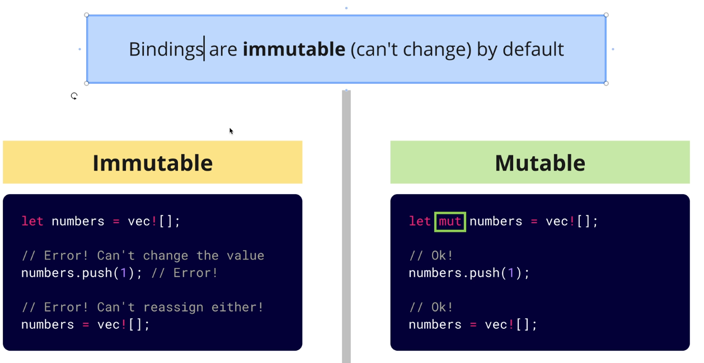

# Rust variables



## Introduction

 In Rust, variables are immutable by default. This means that once a variable is assigned a value, it cannot be changed. However, you can make a variable mutable by using the `mut` keyword.

## immutable variable

```rust

 let number = vec![];
    number = 5; // Error: cannot assign twice to immutable variable
 ```

## mutable variable

```rust

 let mut number = vec![];
    number = 5; // No Error
 ```
