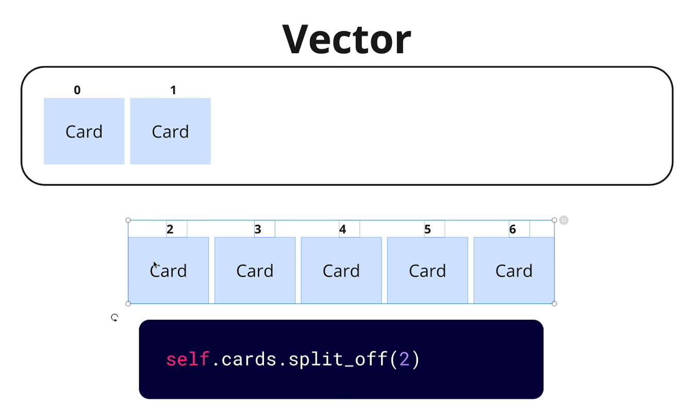

# Vecotrs in rust

## Introduction

Vectors are a dynamic array type in Rust. They are similar to arrays, but they can grow and shrink in size. Vectors are allocated on the heap, which means that they can store a large amount of data without using up all of the stack space.

## Methods for Vectors

### `split_of` means `slice`



- `split_of` is a method that splits a vector into two parts.

```rust

fn main() {
    let vec = vec![1, 2, 3, 4, 5];
    let (left, right) = vec.split_at(3);
    println!("{:?}", left); // [1, 2, 3]
    println!("{:?}", right); // [4, 5]
}
```
