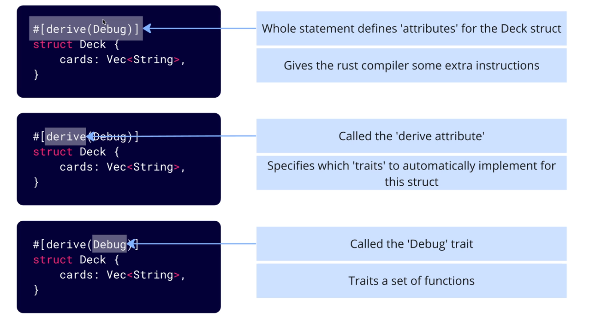

# Playing cards project

This project is a simple project that demonstrates the use of enums in Rust. The project will create a deck of cards and shuffle the deck.

## Base structure


## Steps to create the project

Create a new Rust project using the following command:

```bash
# Create a new Rust project
cargo new Project_1_Deck
# Run the project
cd Project_1_Deck
cargo run
```

## Log output

Avoid unnecessary output from the compiler by using the following command:

`-q` flag is used to suppress the output from the compiler.

```bash
deck cargo run -q
```

## Debugging


`:?` is a debug formatter that can be used to print out the contents of a variable. This is useful for debugging and seeing what is inside a variable.

`#[derive(Debug)]`  give our rust compiler some extra instructions on how to process this struct.

`drive` - drive attribute
`Debug` - Debug trait (Traits a set of fuctions that a type must implement)

```rust
#[derive(Debug)]
fn main() {
    let dec = vec![1, 2, 3, 4, 5];
    println!("Heres your deck: {:?}", deck);
}
```
