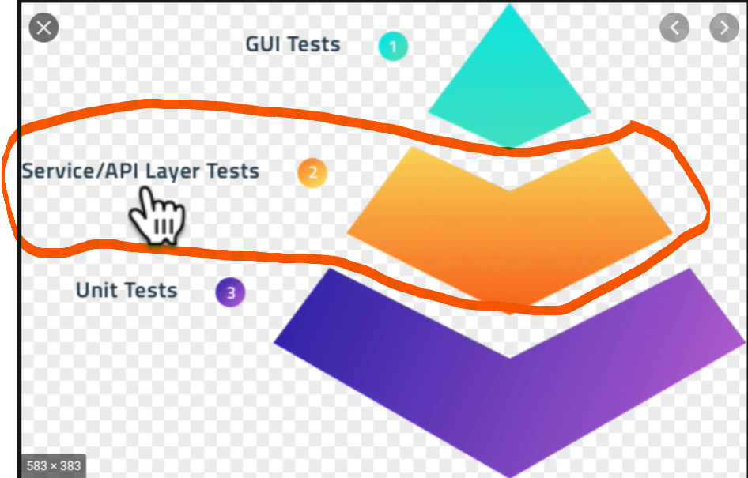

# Fundamentals Testing Node.js API Layer



- test runner (fiend all tests and run them) and give the results
- test fixture (setup and organize) the tests run own environment
- Assertions (check if the code is working as expected)
- Mocking (simulate the behavior of a real object)

Each this task has own packages

## JEST (test runner)

```bash

npm install --save-dev jest

```

```json
"jest": { //setup jest environment
  "testEnvironment": "node"
}

```json
{
  "scripts": {
    "test": "jest",
    "test-watch": "jest --watch",
  }
}
```

- `npm test` run all tests
- `npm run test-watch` run all tests and watch for changes

## Supertest (test fixture)

```bash

npm install --save-dev supertest

```
