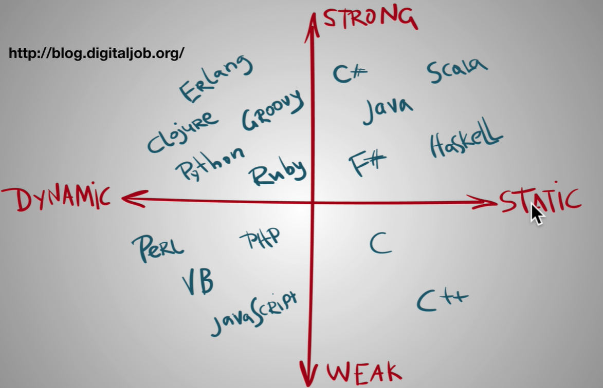
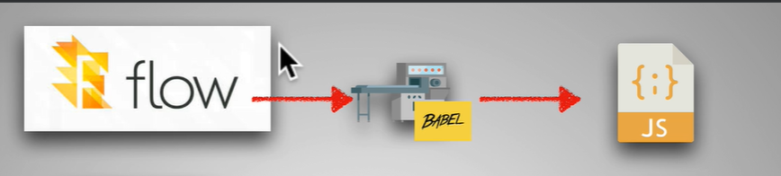
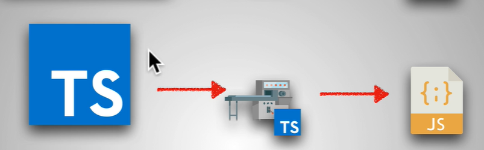
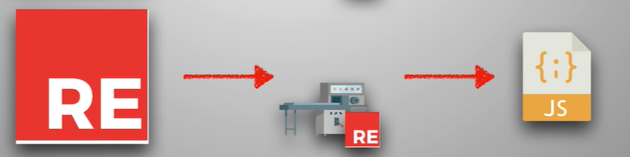
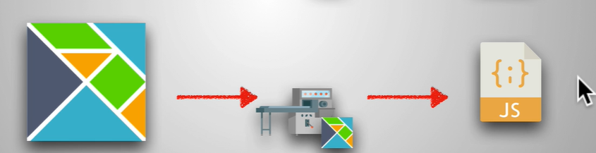

# Fundamentals concepts of TypeScript

- [Fundamentals concepts of TypeScript](#fundamentals-concepts-of-typescript)
  - [Dynamic vs Static Typing](#dynamic-vs-static-typing)
  - [Strongly VS Weakly Typed](#strongly-vs-weakly-typed)
  - [Static Typing in JS](#static-typing-in-js)
  - [TypeScript Setup](#typescript-setup)
    - [Resources: Type VS Interface](#resources-type-vs-interface)

## Dynamic vs Static Typing

- **Dynamic Typing**: Types are associated with values not variables. This means that you can reassign a variable to different types.
- **Static Typing**: Types are associated with variables not values. This means that a variable can only be of one type.

## Strongly VS Weakly Typed

- **Strongly Typed**: Once a variable is declared as a certain type, it cannot be reassigned to another type.
- **Weakly Typed**: Variables can be reassigned to different types.

## Static Typing in JS

- **FLOW**: Facebook's static type checker for JavaScript.
    1. use babel to transpile the code.

- **TypeScript**: Microsoft's static type checker for JavaScript.
    1. TS has own Compiler

- **ReasonML**: Facebook's statically typed language that compiles to JavaScript.
    1. Has own Compiler

- **Elm**: Statically typed language that compiles to JavaScript.
    1. Has own Compiler
    

## TypeScript Setup

- **Install TypeScript**: `npm install -g typescript`
- **Compile TypeScript**: `tsc filename.ts`
- `tsc --init` to create a `tsconfig.json` file
- `tsc -w` to watch for changes in the file
- `tsc -v` to check the version of TypeScript
- `tsc -h` to get help

### Resources: Type VS Interface

[Medium](https://medium.com/@martin_hotell/interface-vs-type-alias-in-typescript-2-7-2a8f1777af4c)
